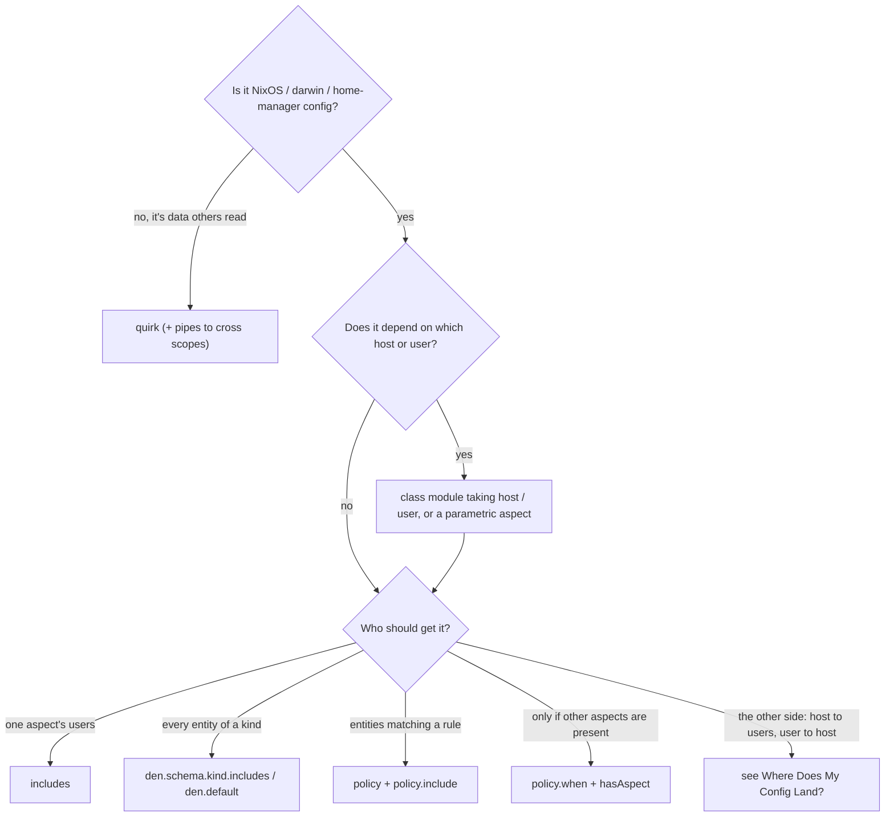

import { Aside } from '@astrojs/starlight/components';

den has several ways to get configuration from where you write it to where it
applies. They overlap on purpose, which makes the first question "which one
do I use?". This page answers it by goal.

## By goal

| I want to… | Use | Guide |
|---|---|---|
| bundle aspects so one brings the others | `includes = [ … ]` on the aspect | [Configure Aspects](/guides/configure-aspects/) |
| configure one module system (NixOS, darwin, home-manager) | a class key: `nixos`, `darwin`, `homeManager`, … | [Class Modules](/explanation/class-modules/) |
| vary config by host or user | a class module taking `{ host, ... }`, or an aspect that is a function of `{ host, ... }` | [Parametric Aspects](/explanation/parametric/) |
| apply an aspect to every host / user / home | `den.schema.<kind>.includes`, or `den.default.includes` for all | [Schema reference](/reference/schema/) |
| give an aspect per-host tunables | the settings pattern (a reserved `settings` key) | [Aspect Settings](/guides/aspect-settings/) |
| attach an aspect to entities by a rule ("every server gets X") | a policy returning `policy.include` | [Policies](/explanation/policies/) |
| include something only when other aspects are present | `policy.when` with `hasAspect` | [den.aspects reference](/reference/aspects/#metaguard--metaaspects--conditional-aspects) |
| create entities (users on a host, hosts in an environment) | a policy returning `policy.resolve.to` | [Policy reference](/reference/policies/) |
| send config from a host to its users, or from a user to its host | see [Where Does My Config Land?](/explanation/where-config-lands/) | [Mutual Config](/guides/mutual/) |
| change the host from a user aspect | the `user` class for the user's own account; `provides.<host>` or `provides.to-hosts` for anything else, never untargeted `nixos` ([#694](https://github.com/denful/den/issues/694)) | [Where Does My Config Land?](/explanation/where-config-lands/#have-a-user-contribute-to-the-hosts-os) |
| write a new class that lands inside another (`user` → `users.users.<name>`) | `den.classes.<name>` plus a `policy.route` policy | [Custom Nix Classes](/guides/custom-classes/) |
| share data (ports, addresses, extension lists) rather than modules | a quirk, plus pipes if it must cross scopes | [Quirks & Pipes](/guides/quirks/) |
| offer optional parts of an aspect for others to pick | sub-aspects under `provides` / `_` | [Configure Aspects](/guides/configure-aspects/#provides) |
| stop an aspect or policy from applying in a subtree | `excludes` | [Policy reference](/reference/policies/#deactivation) |

## Three pairs people mix up

### `provides.to-users` versus a policy

Both deliver config from a host to its users. `provides.to-users` lives
inside the aspect that holds the behaviour; a policy lives beside it.

```nix
# provides: the relationship is written inside the behaviour
den.aspects.igloo.provides.to-users.homeManager.programs.git.enable = true;

# policy: the behaviour is a plain aspect, the relationship is a rule
den.aspects.git.homeManager.programs.git.enable = true;
den.policies.git-for-igloo-users = { host, user, ... }:
  lib.optional (host.name == "igloo") (den.lib.policy.include den.aspects.git);
den.schema.user.includes = [ den.policies.git-for-igloo-users ];
```

`provides` is shorter and stays supported. For new configurations prefer the
policy: the `git` aspect stays reusable anywhere, and "who gets it" is
visible as a rule instead of buried in one host's aspect.

### `policy.route` versus `den.batteries.forward`

Both move a custom class's content into another class. `forward` is the
older battery with more options in one call; `policy.route` is the policy
effect it is built from. Den's own `os`, `user` and `wsl` classes use
`route`. Reach for `route` in new code and for `forward` when you need one
of its extras (per-item `each`, adapter modules) in a single expression.

### A quirk versus a class key

A class key carries **modules** into one module system. A quirk carries
**data** (records, lists, packages) that any aspect can read and turn into
config for whatever module system it writes. If the thing you are sharing
is "open port 443", that is data: a quirk lets the firewall aspect,
a monitoring aspect and a reverse proxy all read it. If it is
"set `services.nginx.enable`", that is a module: use `nixos`.

## A decision path



<Aside type="tip">
When two mechanisms both work, pick the one that keeps the aspect ignorant
of who uses it. Aspects that only describe behaviour can be moved, shared
through namespaces, and reused in another flake unchanged.
</Aside>

## See also

- [Core Principles](/explanation/core-principles/) -- why den separates behaviour from assignment
- [Where Does My Config Land?](/explanation/where-config-lands/) -- scope rules for class content
- [Policies](/explanation/policies/) and [Policy Activation](/explanation/policy-activation/)
- [Quirks & Pipes](/guides/quirks/)
