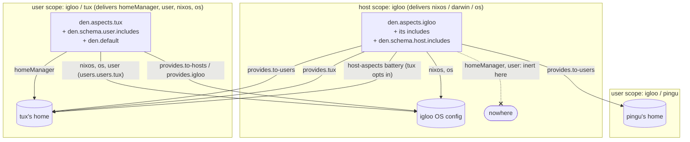

import { Aside } from '@astrojs/starlight/components';

The most common den question is some version of:

> I put `homeManager` config on my host aspect, or on an aspect my host
> includes, and my users don't get it.

That is by design. This page gives the rule, a table of what lands where, and
the mechanism to use for each thing people are usually trying to do.

## The rule

Every entity resolves in its own **scope**: one per host, one per user on
that host (`igloo/tux`, `igloo/pingu`). An aspect's class keys are emitted in
the scope that walks that aspect, and each scope only delivers some classes:

- **Host scope** delivers `nixos`, `darwin` and `os` into the host's OS
  config. It walks the host aspect (`den.aspects.igloo`), everything it
  `includes`, and `den.schema.host.includes`.
- **User scope** delivers `homeManager` into that user's home and `user` into
  that user's own account on the host (`users.users.<name>`). Today it also
  delivers `nixos`, `darwin` and `os` into the host; that is a known isolation
  bug ([#694](https://github.com/denful/den/issues/694)), see the caution
  below. It walks the user aspect (`den.aspects.tux`), everything it
  `includes`, and `den.schema.user.includes`.
- `den.default` is walked in **both**. Its content still lands once, not once
  per scope.

A `homeManager` key the host scope walks is dropped, and den gives no warning.
Host content reaches a user's home only through an explicit edge from host to
user: `provides.to-users`, `provides.<user>`, or the `host-aspects` battery.
Users are separate on purpose. Two people on one machine can have different
desktops.

## What lands where

Every row was measured with a `denTest` probe against den at `main`. The host
is `igloo`, with users `tux` and `pingu` (Home Manager enabled). The `apple` row
uses a separate `aarch64-darwin` host. Each "nowhere" row has a control row
that delivers the same content, so the absence comes from the scope and not
from a broken probe.

| Written on | Class | Lands in |
|---|---|---|
| `den.aspects.igloo` | `nixos` / `os` | igloo's OS config |
| `den.aspects.igloo` | `homeManager` | **nowhere**, in neither tux's nor pingu's home |
| `den.aspects.igloo` | `user` | **nowhere** (`users.users.*` untouched) |
| aspect in `igloo.includes` | `homeManager` | **nowhere** |
| `{ user, ... }:` aspect in `igloo.includes` | `homeManager` | **nowhere** |
| `{ user, ... }:` aspect in `igloo.includes` | `nixos.users.users.${user.userName}` | igloo's OS, once per user |
| `{ user, ... }:` aspect in `igloo.includes` | `user` | **nowhere** |
| `den.schema.host.includes` | `nixos` | igloo's OS config |
| `den.schema.host.includes` | `homeManager` | **nowhere** |
| `den.aspects.tux` | `homeManager` | tux's home only (not pingu's) |
| `den.aspects.tux` | `nixos` / `os` | igloo's OS config (**bug**, [#694](https://github.com/denful/den/issues/694)) |
| `den.aspects.tux` | `user` | `users.users.tux` on igloo |
| `den.aspects.tux` | `darwin` | `apple`'s darwin config, not igloo's (**bug**, [#694](https://github.com/denful/den/issues/694)) |
| `den.aspects.apple` | `nixos` (on a darwin host) | **nowhere** |
| `den.schema.user.includes` | `homeManager` | every user's home |
| `den.default` | `homeManager` | every user's home, once each |
| `den.default` | `nixos` | igloo's OS config, **once** (not once per scope) |
| `den.default` | `user` | `users.users.<name>` for every user, once each |
| `igloo.provides.to-users` | `homeManager` | every user's home |
| `igloo.provides.to-users` | `nixos` | igloo's OS config, once |
| `to-users` on an aspect in `igloo.includes` | `homeManager` / `user` | every user on igloo |
| `igloo.provides.tux` | `homeManager` / `user` | tux only |
| `den.aspects.igloo.tux` (child named after a user) | `homeManager` / `user` | **every** user on igloo (see caution below) |
| `den.aspects.igloo.stuff` (any other child) | `homeManager` | **nowhere** (children are not walked unless included) |
| `igloo.homeManager` + `tux.includes = [ den.batteries.host-aspects ]` | `homeManager` | tux's home; pingu's only if pingu opts in too |
| `den.schema.user.includes = [ den.batteries.host-aspects ]` | `homeManager` | every user's home |
| `tux.provides.igloo` | `homeManager` | tux's home, only on igloo |
| `tux.provides.igloo` / `tux.provides.to-hosts` | `nixos` | igloo's OS config |

<Aside type="caution" title="den.aspects.igloo.tux">
The `host-to-users` policy includes a host child named after a user when it
resolves that user. At `main`, a static `den.aspects.igloo.tux` reaches
**every** user on igloo, and a `{ user, ... }:` child named `tux` runs once for
each user. That looks like a defect, not a design choice, so don't rely on it.
To target one user, use `den.aspects.igloo.provides.tux`, which reaches tux
only.
</Aside>

## The picture



Solid arrows deliver. The crossed arrow is the common mistake: host-scope
`homeManager` has nowhere to go.

## How do I…

### Apply Home Manager config to every user on a host

Put it under the host's `provides.to-users`:

```nix
den.aspects.igloo.provides.to-users = {
  homeManager.programs.bash.enable = true;
};
```

`to-users` also works on a feature aspect that the host includes, so one
aspect can carry both its system and user parts:

```nix
den.aspects.hyprland = {
  nixos.programs.hyprland.enable = true;
  provides.to-users.homeManager.wayland.windowManager.hyprland.enable = true;
};
den.aspects.igloo.includes = [ den.aspects.hyprland ];
```

The other option is to let users opt into the host's whole tree with the
[`host-aspects` battery](/reference/batteries/#denbatterieshost-aspects).
Every `homeManager` key the host aspect walks (its own and its includes') then
reaches that user:

```nix
den.aspects.igloo.includes = [ den.aspects.my-feature ];  # has homeManager
den.aspects.tux.includes = [ den.batteries.host-aspects ];      # one user
# or every user on every host:
den.schema.user.includes = [ den.batteries.host-aspects ];
```

Use `to-users` when the host decides. Use `host-aspects` when each user
decides whether to take the host's home config.

### Add users to groups from a non-host aspect

Use the `user` class inside `to-users`. It is forwarded to
`users.users.<userName>` for each user:

```nix
den.aspects.wireshark = {
  nixos.programs.wireshark.enable = true;
  provides.to-users.user.extraGroups = [ "wireshark" ];
};
den.aspects.igloo.includes = [ den.aspects.wireshark ];
```

A `{ user, ... }:` aspect in the host's includes also works, but only with the
`nixos` class. It runs once per user and emits on the host:

```nix
den.aspects.wireshark = { user, ... }: {
  nixos.users.users.${user.userName}.extraGroups = [ "wireshark" ];
};
```

The same aspect written with the `user` class (`user.extraGroups = …`) lands
nowhere, because host scope does not deliver `user`.

To restrict the group to certain users, write it on those users' aspects:
`den.aspects.alice.user.extraGroups = [ "wireshark" ]`.

### Give one user host-specific Home Manager config

Either side can declare it:

```nix
# the host configures tux
den.aspects.igloo.provides.tux.homeManager.programs.tmux.enable = true;

# or tux configures itself, only on igloo
den.aspects.tux.provides.igloo.homeManager.programs.tmux.enable = true;
```

Both reach tux on igloo and nobody else. For selection by a condition, use
`to-users` with the `user` argument:

```nix
den.aspects.igloo.provides.to-users = { user, ... }: {
  homeManager.programs.helix.enable = user.name == "alice";
};
```

### Have a user contribute to the host's OS

For the user's own account, use the `user` class; it only ever touches
`users.users.<name>`:

```nix
den.aspects.tux.user.extraGroups = [ "wheel" ];   # users.users.tux.extraGroups
```

For anything else on the host, name the host explicitly. For one host, use
`den.aspects.tux.provides.igloo.nixos`; for every host the user lives on, use
`den.aspects.tux.provides.to-hosts = { host, ... }: { … }`.

<Aside type="caution" title="Untargeted nixos/os on a user aspect (#694)">
Today `den.aspects.tux.nixos` (and `darwin`, `os`) reaches every host tux
lives on without any opt-in. That breaks isolation between users and hosts:
one user's aspect changes a shared host for everyone. It is tracked as a bug
in [#694](https://github.com/denful/den/issues/694); the planned fix makes it
opt-in through a `user-aspects` battery, mirroring `host-aspects`. Don't rely
on the untargeted form. Use the `user` class or `provides.<host>` /
`provides.to-hosts` above.
</Aside>

## Why

The pipeline walks each scope's aspect tree and collects class content per
scope ([Scope Partitioning](/explanation/scope-partitioning/)). Classes then
leave a scope through routes. The host scope feeds its OS classes into
`nixosSystem`/`darwinSystem`. The user scope feeds `homeManager` into
`home-manager.users.<name>`, and `user` into `users.users.<name>` on the host
(the `user-to-host` policy). No route takes content from host scope into a
user's home. A `homeManager` module collected at host scope therefore has no
destination, including one from a `{ user, ... }:` aspect: that aspect fans
out over the users but still emits at the host.

The explicit edges are policies. `provides.to-users`, `provides.<name>` and
`provides.to-hosts` become cross-entity policy effects, with no battery
needed ([Mutual Providers](/guides/mutual/)). The `host-aspects` battery spawns
a node that resolves the host's aspect tree again for the user's classes. See
[Policies](/reference/policies/) for the built-in `host-to-users`,
`user-to-host` and `os-to-host` policies.
