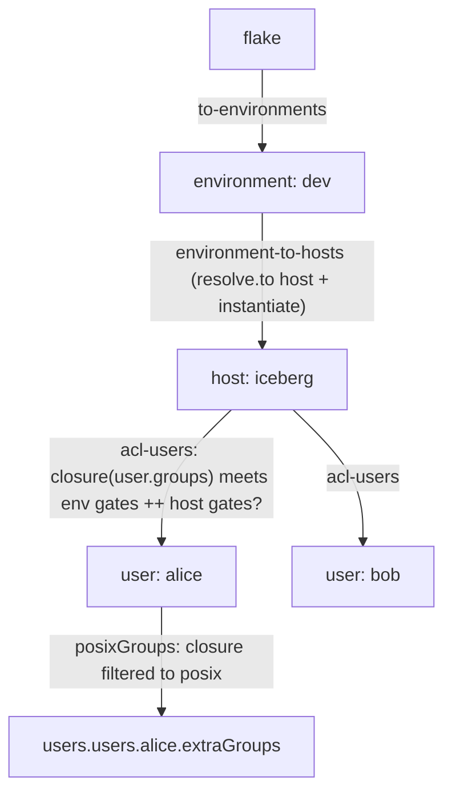
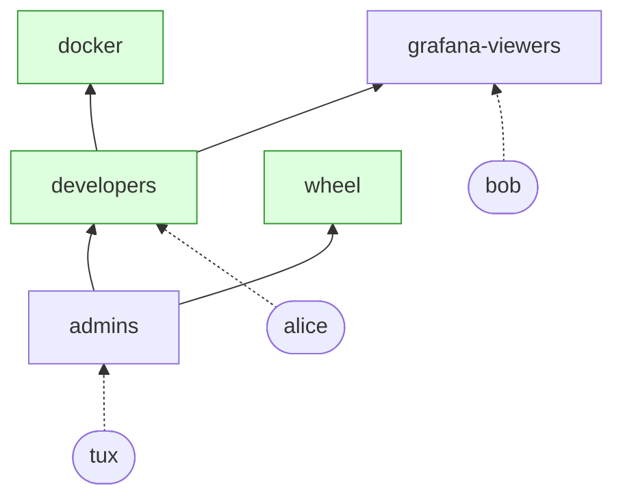

import { Aside } from '@astrojs/starlight/components';

<Aside title="Source" icon="github">
Built on the same topology as
[`templates/fleet-demo`](https://github.com/denful/den/tree/main/templates/fleet-demo) --
[`modules/policies/core.nix`](https://github.com/denful/den/blob/main/modules/policies/core.nix) --
[`nix/lib/policy-effects.nix`](https://github.com/denful/den/blob/main/nix/lib/policy-effects.nix)
</Aside>

This guide builds an access-control layer in user space: no framework
changes, only `den.schema`, policies, parametric aspects and a quirk. It is a
pattern, not a battery — copy it and adapt the data model to your fleet.

## The problem

With den's defaults, users are declared per host:

```nix
den.hosts.x86_64-linux.igloo.users.tux = { };
den.hosts.x86_64-linux.iceberg.users.tux = { };
den.hosts.x86_64-linux.iceberg.users.alice = { };
```

This stops scaling once there are more than a handful of hosts and people.
"Who can log into what" is scattered over every host declaration,
`extraGroups` is repeated per user per host, and nothing ties "alice is a
developer" to "developers get `docker` and log into dev machines".

The pattern replaces per-host user lists with three facts, each stated once:

- what **groups** exist and which groups imply which,
- which groups each **user** is in,
- which groups each **environment** and **host** admits.

Everything else — the set of users on a host, their Unix groups — is derived.

## Data model

| Concept | Declared as | Meaning |
|---|---|---|
| Environment | `acl.environments.<env>` | A named slice of the fleet (`prod`, `dev`) carrying shared settings (`domain`, `timezone`) and a baseline list of **login gates**. |
| Group | `acl.groups.<name>` | A name with `labels` (what consumes it) and `members` (other groups whose members inherit this one). |
| User | `acl.users.<name>` | An identity plus the groups it is **directly** in. No host list. |
| Host gate | `den.hosts.<sys>.<host>.system-access-groups` | Extra login gates for one host, added to its environment's. |

Resolution for a user `U` on host `H` in environment `E`:

1. **Closure.** Expand `U.groups` transitively: if `developers.members`
   contains `admins`, every admin is also a developer.
2. **Login.** `U` gets an account on `H` iff the closure intersects
   `E.system-access-groups ++ H.system-access-groups`.
3. **Unix groups.** `U`'s `extraGroups` on `H` are the closure filtered to
   groups labelled `posix`.

Login is opt-in: a group admits nobody unless some gate names it. That is
what lets identity-only users (a web-SSO account, say) live in the same
registry without ever getting a Unix account.

Labels are an open set. This guide consumes `posix`; an identity-provider
module can consume `oauth-grant` from the same graph (see
[Extending](#extending)).

## How it maps onto den

| Piece | den primitive |
|---|---|
| `environment` as a scope between flake and host | `den.schema.environment.isEntity` + a `resolve.to "environment"` policy ([Policies](/explanation/policies/)) |
| Host-to-environment membership | `den.schema.host.imports` adding an `environment` option ([Schema](/reference/schema/)) |
| Users admitted by ACL instead of `host.users` | a host policy emitting `resolve.to "user"`, with `den.policies.host-to-users` excluded |
| Per-user Unix groups | a parametric `{ host, user }` aspect in `den.schema.user.includes` ([Parametric aspects](/explanation/parametric/)) |
| Environment settings in class modules | the `environment` context argument, inherited by every host scope under it |
| Host-side view of admitted users | a quirk exposed from user scope with `pipe.expose` ([Cross-Scope Pipes](/guides/quirks-cross-scope/)) |



Each arrow is one policy. Only the `acl-users` step consults the group graph.

The groups, users and environments registries are plain `lib.types`
options under a user-chosen `acl.*` namespace. They are **not** den API; den
only sees the entities the policies resolve.

## Worked example

Three files, for any flake-parts + `import-tree` den flake with home-manager
wired (the [`default` template](/tutorials/default/) is enough). They replace
its host and user declarations; keep your own `den.default` for
`stateVersion` and hardware.

### 1. Schema

```nix
# modules/acl-schema.nix
{ lib, den, ... }:
let
  inherit (lib) mkOption types;
  groupNames = mkOption {
    type = types.listOf types.str;
    default = [ ];
  };

  environmentType = types.submodule (
    { name, config, ... }:
    {
      freeformType = types.attrsOf types.anything;
      imports = [ den.schema.environment ];
      config._module.args.environment = config;
      options = {
        name = mkOption { type = types.str; default = name; };
        domain = mkOption { type = types.str; };
        timezone = mkOption { type = types.str; default = "UTC"; };
        system-access-groups = groupNames;
      };
    }
  );

  groupType = types.submodule {
    options = {
      description = mkOption { type = types.str; default = ""; };
      labels = groupNames;
      members = groupNames;
    };
  };

  # Mirrors den's own user entity shape so batteries such as define-user
  # find userName, classes and aspect.
  userType = types.submodule (
    { name, config, ... }:
    {
      freeformType = types.attrsOf types.anything;
      imports = [ den.schema.user ];
      config._module.args.user = config;
      options = {
        name = mkOption { type = types.str; default = name; };
        userName = mkOption { type = types.str; default = name; };
        classes = mkOption {
          type = types.listOf types.str;
          default = [ "homeManager" ];
        };
        aspect = mkOption {
          type = types.raw;
          default = den.aspects.${name} or { };
        };
        groups = groupNames;
      };
    }
  );
in
{
  options.acl = {
    environments = mkOption { type = types.attrsOf environmentType; default = { }; };
    groups = mkOption { type = types.attrsOf groupType; default = { }; };
    users = mkOption { type = types.attrsOf userType; default = { }; };
  };

  config = {
    den.schema.environment.isEntity = true;
    den.schema.user.isEntity = true;
    den.schema.host.imports = [
      {
        options.environment = mkOption { type = types.str; };
        options.system-access-groups = groupNames;
      }
    ];
  };
}
```

`imports = [ den.schema.environment ]` and `imports = [ den.schema.user ]`
make any `den.schema.environment.imports` / `den.schema.user.imports` you add
later apply to registry entries too.

### 2. Resolution

```nix
# modules/acl-policies.nix
{ lib, den, config, ... }:
let
  inherit (den.lib.policy) resolve instantiate;
  inherit (config.acl) environments groups users;

  # A member of group G is also a member of every group listing G in `members`.
  closure =
    direct:
    map (g: g.key) (
      builtins.genericClosure {
        startSet = map (key: { inherit key; }) direct;
        operator =
          { key }:
          lib.mapAttrsToList (name: _: { key = name; }) (
            lib.filterAttrs (_: g: lib.elem key g.members) groups
          );
      }
    );

  gatesFor = environment: host: environment.system-access-groups ++ host.system-access-groups;

  canLogin =
    environment: host: user:
    lib.any (g: lib.elem g (gatesFor environment host)) (closure user.groups);

  posixGroups = user: lib.filter (g: lib.elem "posix" groups.${g}.labels) (closure user.groups);

  allHosts = lib.concatMap lib.attrValues (lib.attrValues den.hosts);
in
{
  # flake -> environment
  den.policies.to-environments =
    _: lib.mapAttrsToList (_: environment: resolve.to "environment" { inherit environment; }) environments;

  # environment -> host
  den.policies.environment-to-hosts =
    { environment, ... }:
    lib.concatMap (
      host:
      lib.optionals (host.environment == environment.name && host.intoAttr != [ ]) [
        (resolve.to "host" { inherit host; })
        (instantiate host)
      ]
    ) allHosts;

  # host -> user, for every user the gates admit
  den.policies.acl-users =
    { host, environment, ... }:
    map (user: resolve.to "user" { inherit user; }) (
      lib.filter (canLogin environment host) (lib.attrValues users)
    );

  den.schema.flake.includes = [ den.policies.to-environments ];
  den.schema.environment.includes = [ den.policies.environment-to-hosts ];
  den.schema.host.includes = [ den.policies.acl-users ];

  # The environment walk replaces den's default host and user walks.
  den.schema.host.excludes = [ den.policies.host-to-users ];
  den.schema.flake-system.excludes = [
    den.policies.system-to-os-outputs
    den.policies.system-to-hm-outputs
  ];

  # Fires once per admitted user; the name keeps one entry per user and host.
  den.schema.user.includes = [
    (
      { host, user }:
      {
        name = "acl-posix-groups/${user.userName}@${host.name}";
        nixos = {
          users.users.${user.userName}.extraGroups = posixGroups user;
          users.groups = lib.genAttrs (posixGroups user) (_: { });
        };
      }
    )
  ];
}
```

`acl-users` destructures `environment` although it runs at host scope: a
host resolved under an environment scope inherits that binding, so the policy
sees the host's own environment without looking it up.

<Aside>
Excluding `host-to-users` means `den.hosts.<sys>.<host>.users` is ignored.
Every user now comes from `acl.users`. To keep a few hand-declared users,
leave `host-to-users` in place and make sure the two sets do not overlap.
</Aside>

### 3. Data

```nix
# modules/fleet.nix
{ den, ... }:
{
  acl.environments = {
    prod = {
      domain = "example.com";
      system-access-groups = [ "admins" ];
    };
    dev = {
      domain = "dev.example.com";
      timezone = "Europe/Berlin";
      system-access-groups = [ "developers" ];
    };
  };

  acl.groups = {
    admins.description = "Log in anywhere";
    developers = {
      labels = [ "posix" ];
      members = [ "admins" ];      # every admin is a developer
    };
    wheel = {
      labels = [ "posix" ];
      members = [ "admins" ];
    };
    docker = {
      labels = [ "posix" ];
      members = [ "developers" ];
    };
    grafana-viewers.members = [ "developers" ];
  };

  acl.users = {
    tux.groups = [ "admins" ];
    alice.groups = [ "developers" ];
    bob.groups = [ "grafana-viewers" ];
  };

  den.hosts.x86_64-linux = {
    igloo.environment = "prod";
    iceberg = {
      environment = "dev";
      system-access-groups = [ "grafana-viewers" ];  # host-only gate
    };
  };

  den.aspects.environment-defaults.nixos =
    { environment, ... }:
    {
      networking.domain = environment.domain;
      time.timeZone = environment.timezone;
    };

  den.default.includes = [
    den.batteries.define-user
    den.batteries.hostname
    den.aspects.environment-defaults
  ];
}
```

The group graph this data declares. An arrow from A to B means members of A
are also members of B; green groups are labelled `posix`:



Result:

| Host | Gates | Users | `extraGroups` |
|---|---|---|---|
| `igloo` (prod) | `admins` | tux | tux: `developers wheel docker` |
| `iceberg` (dev) | `developers`, `grafana-viewers` | alice, bob, tux | alice: `developers docker`; bob: none; tux: `developers wheel docker` |

tux reaches `iceberg` through `admins → developers`. bob is admitted only
because `iceberg` adds `grafana-viewers` as a host gate; on `igloo` he has no
account. `igloo` gets `time.timeZone = "UTC"` and `networking.domain =
"example.com"` from its environment; `iceberg` gets Berlin and
`dev.example.com`.

## Reading the environment in aspects

Any class module or parametric aspect under a host can take `environment`
as a context argument, exactly like `host` or `user`:

```nix
den.aspects.acme.nixos =
  { environment, ... }:
  {
    security.acme.certs.${environment.domain}.domain = "*.${environment.domain}";
  };
```

<Aside type="caution">
Class content on the environment entity's **own** aspect (for example
`den.aspects.dev.nixos`) stays at the environment scope and does not reach
the hosts under it. Vary host config with an aspect that takes `environment`,
as above, and include it on the hosts (here through `den.default`).
</Aside>

Quirk emitters can take `environment` too, so records collected across hosts can carry their
environment:

```nix
den.quirks.monitoring-targets.description = "Scrape targets";

den.aspects.node-exporter.monitoring-targets =
  { environment, host, ... }:
  { inherit (host) name; env = environment.name; };
```

Hosts in one environment are siblings under its scope, so
`pipe.collect` gathers only same-environment peers, and `pipe.collectAll`
reaches across environments. See [Quirks & Pipes](/guides/quirks/).

## Extending

### Tell host aspects who is admitted

Some host-level modules need the list of users resolved onto the host
(`hardware.openrazer.users`, a group's member list, `authorized_keys` for a
shared account). Emit one record per user and expose it upward:

```nix
{ lib, den, ... }:
let
  inherit (den.lib.policy) pipe;
in
{
  den.quirks.login-users.description = "Users admitted to a host by the ACL";

  den.policies.expose-login-users =
    { user, ... }: [ (pipe.from "login-users" [ pipe.expose ]) ];

  den.schema.user.includes = [
    den.policies.expose-login-users
    (
      { host, user }:
      {
        name = "login-users/${user.userName}@${host.name}";
        login-users = { inherit (user) name groups; };
      }
    )
  ];

  den.aspects.wireshark.nixos =
    { login-users, lib, ... }:
    {
      programs.wireshark.enable = true;
      users.users = lib.genAttrs (map (u: u.name) login-users) (_: {
        extraGroups = [ "wireshark" ];
      });
    };
}
```

A host that includes `wireshark` puts exactly its admitted users in the
`wireshark` group, and nobody else.

### Other consumers of the same graph

Groups with other labels are read directly from `config.acl` at module level,
outside the pipeline. An identity-provider module, for instance, provisions
every user (admitted anywhere or not) and every group labelled
`oauth-grant`, reusing `closure` from the policies file (move it to a shared
`let` or a `_module.args` value):

```nix
oauthGroups = lib.filterAttrs (_: g: lib.elem "oauth-grant" g.labels) config.acl.groups;
membersOf = group:
  lib.attrNames (lib.filterAttrs (_: u: lib.elem group (closure u.groups)) config.acl.users);
```

Identity-only users are registry entries whose closure reaches no gate. They
exist for the identity provider and never resolve onto a host.

### More gates and grants

- **Role defaults.** Give `system-access-groups` a default computed from
  another host option (`if role == "server" then [ "server-access" ] else …`)
  instead of setting it on every host.
- **Grants separate from gates.** If "who is allowed into prod" and "what a
  host accepts" are owned by different people, add a second list (for example
  `acl.grants.<env>`) and admit users whose closure hits `grants ∩ gates`.
- **A fleet scope.** Insert a `fleet` entity between flake and environments
  (`resolve.to "fleet"`, as in `templates/fleet-demo`) when you need one place
  to hang fleet-wide context or pipe collection.

## See also

- [Fleets & Multi-Host](/explanation/fleet/) — the scope tree the policies build
- [Template: Fleet Demo](/tutorials/fleet-demo/) — the same topology without ACLs
- [Policies](/explanation/policies/) and [policy reference](/reference/policies/) — `resolve.to`, `instantiate`, `pipe.*`
- [Schema reference](/reference/schema/) — `den.schema.<kind>.imports`, `includes`, `excludes`, `isEntity`
- [Cross-Scope Pipes](/guides/quirks-cross-scope/) — `pipe.expose`, `pipe.collect`, `pipe.collectAll`
