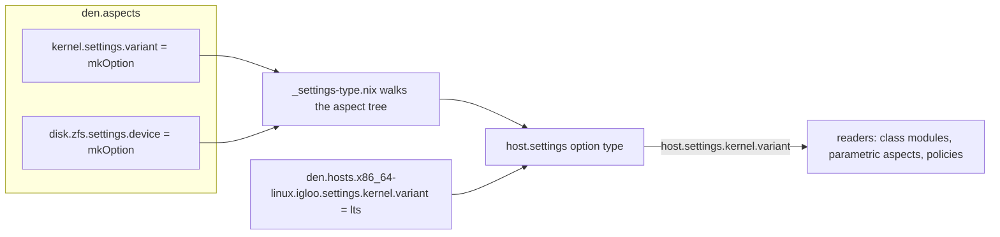

import { Aside, Steps } from '@astrojs/starlight/components';

<Aside title="Pattern, not a battery">
Everything on this page is built from existing Den primitives:
[`den.reservedKeys`](/reference/aspects/#reserved-keys),
[`den.schema`](/reference/schema/#denschema) and class modules that take
`host`. The one helper, `settings-type.nix`, is user code: copy it into your
flake.
</Aside>

## The problem

Aspects get shared across hosts, and most of an aspect is the same on every
host. A few values are not: the disk a ZFS pool lives on, which kernel build
to use, how many worker processes a service runs. You have three bad options:

- hard-code the value, and the aspect can't be reused;
- add a custom option per aspect to `den.schema.host`, and the host schema
  grows with every aspect;
- declare a NixOS option inside the aspect's `nixos` module, and it only works
  in `nixos` modules. Policies, `homeManager` modules and other hosts can't
  read it, and every host that sets it has to know the NixOS option path.

The settings pattern gives each aspect a typed slot. The aspect declares
its options and reads the values. Hosts set them. One generator,
written once, turns every aspect's declarations into a single typed option on
the host entity:



Adding a setting to an aspect never touches the host schema.

## Quick start

<Steps>

1. **Reserve the `settings` key**

    ```nix
    den.reservedKeys = [ "settings" ];
    ```

    Den treats a reserved key as structural. The pipeline doesn't dispatch it
    as class content or as a nested aspect, and the value you wrote is left
    as-is so the generator can read it back.

2. **Add the generator**

    Save this as a file that your module tree does not auto-import (the
    leading underscore keeps [import-tree](https://github.com/vic/import-tree)
    away from it):

    ```nix
    # _settings-type.nix
    { den, lib }:
    let
      inherit (lib) mkOption types;
      inherit (den.lib.aspects.fx.keyClassification) isStructuralKey;

      # Keys that are pipeline machinery, class content or quirk data,
      # never child aspects.
      skipKey = k:
        isStructuralKey k
        || (den.classes or { }) ? ${k}
        || (den.quirks or { }) ? ${k};

      # `settings` is either a bare attrset of options, or a module with
      # options / config / imports.
      reshape = raw:
        if raw ? options || raw ? config || raw ? imports
        then raw
        else { options = raw; };

      hasSettingsDeep = node:
        builtins.isAttrs node
        && (node ? settings
            || lib.any (k: !(skipKey k) && hasSettingsDeep (node.${k} or null))
                 (builtins.attrNames node));

      # One submodule per aspect-tree node. A node can carry its own settings
      # and also be the parent of aspects that do.
      nodeModule = node:
        let
          own = reshape (node.settings or { });
          children = lib.filterAttrs
            (k: v: !(skipKey k) && builtins.isAttrs v && hasSettingsDeep v) node;
        in
        {
          imports = own.imports or [ ];
          config = own.config or { };
          options = (own.options or { }) // lib.mapAttrs (name: child:
            mkOption {
              type = types.submodule (nodeModule child);
              default = { };
              description = "Settings under ${name}";
            }) children;
        };
    in
    types.submodule (nodeModule (den.aspects or { }))
    ```

3. **Attach it to the host schema**

    Any module that receives the `den` module argument can build the type:

    ```nix
    { den, lib, ... }:
    {
      den.schema.host.imports = [
        {
          options.settings = lib.mkOption {
            type = import ./_settings-type.nix { inherit den lib; };
            default = { };
            description = "Per-aspect typed settings";
          };
        }
      ];
    }
    ```

4. **Declare settings on an aspect**

    `settings` sits next to `includes` and `nixos`, and holds `lib.mkOption`
    declarations:

    ```nix
    den.aspects.kernel = {
      settings.variant = lib.mkOption {
        type = lib.types.enum [ "lts" "latest" ];
        default = "latest";
        description = "Kernel release line";
      };

      nixos = { host, pkgs, ... }:
        let cfg = host.settings.kernel; in {
          boot.kernelPackages =
            if cfg.variant == "lts" then pkgs.linuxPackages
            else pkgs.linuxPackages_latest;
        };
    };
    ```

5. **Set values on the host**

    ```nix
    den.hosts.x86_64-linux.igloo = {
      users.tux = { };
      settings.kernel.variant = "lts";
    };

    den.aspects.igloo.includes = [ den.aspects.kernel ];
    ```

    A host that's fine with the defaults doesn't need to write `settings`
    at all.

</Steps>

## Paths mirror the aspect tree

The option path under `host.settings` is the aspect's path under
`den.aspects`. Nested aspects nest their settings:

```nix
den.aspects.disk.zfs = {
  settings.device = lib.mkOption {
    type = lib.types.str;
    description = "Pool device, e.g. /dev/disk/by-id/nvme-...";
  };
  nixos = { host, ... }: {
    disko.devices.disk.main.device = host.settings.disk.zfs.device;
  };
};

den.hosts.x86_64-linux.igloo.settings = {
  disk.zfs.device = "/dev/disk/by-id/nvme-example";
  kernel.variant = "lts";
};
```

The generator only walks keys that aren't structural, a registered class or a
registered quirk, and only branches that lead to a `settings` block get an
option. That means `host.settings.disk.zfs.nixos` never exists, and aspects
without settings add nothing.

## Reading settings

`host` is the resolved host entity, so `host.settings` is readable anywhere
`host` is:

- **Class modules.** `nixos = { host, ... }: ...` gets `host` through
  [class-level context injection](/explanation/parametric/#where-parametric-args-work).
  Bind `cfg = host.settings.<path>` the same way you'd use
  `cfg = config.services.foo`.
- **Parametric aspects.** `den.aspects.foo = { host, ... }: { ... }` can
  change which classes or includes it emits based on a setting.
- **Policies.** A setting can gate what a policy emits:

    ```nix
    den.aspects.web.settings.public = lib.mkOption {
      type = lib.types.bool;
      default = false;
    };
    den.aspects.firewall-open.nixos.networking.firewall.allowedTCPPorts = [ 443 ];

    den.policies.open-public = { host, ... }:
      lib.optionals host.settings.web.public [
        (den.lib.policy.include den.aspects.firewall-open)
      ];

    den.schema.host.includes = [ den.policies.open-public ];
    ```

    Pipe predicates work the same way. For example,
    `pipe.broadcast ({ host, ... }: host.settings.sync.isHub)` delivers only to
    hosts that have the setting enabled. See [Quirks & Pipes](/guides/quirks/).

- **Outside the pipeline.** `den.hosts.<system>.<name>.settings` is a normal
  option value you can read in `nix repl` or in tests.

An aspect can read another aspect's settings, since it's all one tree, but
that ties the two aspects together. It's better to read only your own path.

## Defaults, overrides and merging

`host.settings` is a submodule. Values merge through the module system, so the
usual priorities apply. From weakest to strongest:

| Source | Example |
|---|---|
| `default` on the aspect's `mkOption` | `default = "latest";` |
| `lib.mkDefault`, from the aspect's module-shaped `settings.config` or from `den.schema.host` (fleet-wide) | `config.variant = lib.mkDefault "lts";` |
| Plain value on the host | `settings.kernel.variant = "lts";` |
| `lib.mkForce` anywhere | `lib.mkForce "latest"` |

All `mkDefault` definitions share one priority, wherever they come from. If
two of them disagree, you get a conflict error rather than a silent winner.

**Required settings.** Leave out `default` and the setting becomes required.
Any host that includes the aspect and reads the value must set it:

```
error: The option `den.hosts.x86_64-linux.igloo.settings.disk.zfs.device'
       was accessed but has no value defined. Try setting the option.
```

**Wrong values** fail the option type at the exact path. For example,
`settings.kernel.variant = "bogus"` fails the `enum`.

**Group-level defaults.** A module in `den.schema.host` sees the host's
`config`, so it can set defaults based on other host attributes:

```nix
den.schema.host.imports = [
  ({ config, lib, ... }: {
    options.tier = lib.mkOption {
      type = lib.types.str;
      default = "prod";
    };
    config.settings.kernel.variant =
      lib.mkIf (config.tier == "prod") (lib.mkDefault "lts");
  })
];
```

Every `prod` host gets `lts` unless the host sets `variant` itself.

**Module-shaped settings.** If an aspect needs a computed default or wants to
import a shared options module, write `settings` as a module:

```nix
den.aspects.kernel.settings = {
  options.variant = lib.mkOption { type = lib.types.str; default = "latest"; };
  config.variant = lib.mkDefault "lts";
  imports = [ ./kernel-settings-extra.nix ];
};
```

<Aside type="caution" title="One definition per aspect">
Reserved keys aren't merged across modules. The last definition of
`den.aspects.<path>.settings` wins, and earlier ones are dropped silently.
If two files each set `den.aspects.kernel.settings.<name>`, only one of
them ends up in the aspect. Declare each aspect's settings in one place
(a `settings.nix` next to the aspect works fine). Split declarations across
files with `settings.imports`.
</Aside>

## Settings on other entity kinds

The generator doesn't depend on hosts. Attach the same type to any entity
kind to get a mirrored namespace there. For users:

```nix
den.schema.user.imports = [
  {
    options.settings = lib.mkOption {
      type = import ./_settings-type.nix { inherit den lib; };
      default = { };
    };
  }
];

den.aspects.git = {
  settings.email = lib.mkOption { type = lib.types.str; };
  homeManager = { user, ... }: {
    programs.git.settings.user.email = user.settings.git.email;
  };
};

den.hosts.x86_64-linux.igloo.users.tux.settings.git.email = "tux@example.com";
```

Every entity kind gets the full tree. `user.settings.kernel` exists too, even
though it only means something on hosts. The type describes every settings
block, not the ones relevant to that kind.

## Adding a setting

1. Add a `lib.mkOption` to the aspect's `settings` block, or create the block.
   Give it a `default` unless the value really differs per host and has no
   sensible fallback.
2. In the consumer (class module, parametric aspect or policy), take `host`
   and read `host.settings.<aspect path>.<name>`.
3. On each host that needs a non-default value, set
   `settings.<aspect path>.<name>`.
4. Build or evaluate an affected host. Type errors and missing required
   values show up at evaluation time with the full option path.

No schema edits are needed. The generator picks up the new option.

## Caveats

- **Declare settings on the static aspect attrset.** When the whole aspect is
  a function (`den.aspects.foo = { host, ... }: { settings = ...; }`), the
  generator can't see `settings` without calling the function, so the
  setting isn't discovered. Keep `settings` at the top level and make only
  the class modules or includes parametric.
- **`settings` holds declarations, not values.** A bare `foo = "bar";`
  inside `settings` gets read as an option declaration, and evaluation fails
  with `An option declaration for ... has type ...`. Use
  `mkOption { default = "bar"; }`, or the module-shaped form with `config`.
- **Settings are not quirks.** Settings are inputs to one entity. The host
  sets them and its aspects read them. [Quirks](/guides/quirks/) move data
  between aspects and scopes. If an aspect needs to publish something for
  other aspects to collect, use a quirk.

## See also

- [Reserved keys](/reference/aspects/#reserved-keys): what `den.reservedKeys` does
- [Schema reference](/reference/schema/): `den.schema.<kind>`, `imports` and `includes`
- [Parametric aspects](/explanation/parametric/): where `host` and `user` are in scope
- [Policies reference](/reference/policies/): `den.lib.policy.include` and friends
- [Quirks & Pipes guide](/guides/quirks/): data flow between aspects
