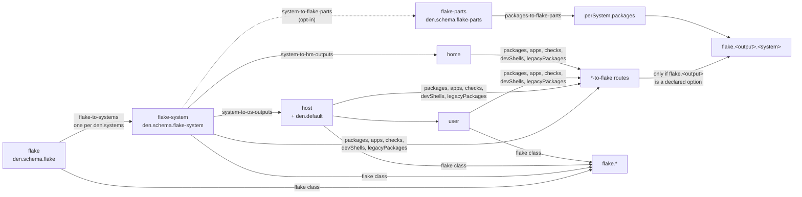

import { Aside, Steps } from '@astrojs/starlight/components';

<Aside title="Source" icon="github">
[`modules/policies/flake.nix`](https://github.com/denful/den/blob/main/modules/policies/flake.nix) --
[`modules/policies/flake-parts.nix`](https://github.com/denful/den/blob/main/modules/policies/flake-parts.nix) --
[`modules/outputs.nix`](https://github.com/denful/den/blob/main/modules/outputs.nix) --
[`nix/flakeOutputs.nix`](https://github.com/denful/den/blob/main/nix/flakeOutputs.nix) --
[`forward-flake-level.nix`](https://github.com/denful/den/blob/main/templates/ci/modules/internal-api/forward-flake-level.nix) --
[`packages-merge.nix`](https://github.com/denful/den/blob/main/templates/ci/modules/public-api/packages-merge.nix)
</Aside>

Hosts and homes turn into `nixosConfigurations`, `darwinConfigurations` and
`homeConfigurations` without any extra setup (see [Output](/reference/output/)).
This guide covers everything else a flake exports: packages, apps, checks,
dev shells, `legacyPackages`, and attributes that are not per-system at all,
such as `deploy` or `images`.

## The output classes

Den registers one class per system-scoped flake output. An aspect key with
one of these names is output content, the same way `nixos` is NixOS content:

| Class | Lands at | Typical content |
|---|---|---|
| `packages` | `flake.packages.<system>` | derivations |
| `apps` | `flake.apps.<system>` | `{ type = "app"; program = ...; }` |
| `checks` | `flake.checks.<system>` | derivations built by `nix flake check` |
| `devShells` | `flake.devShells.<system>` | `pkgs.mkShell { ... }` |
| `legacyPackages` | `flake.legacyPackages.<system>` | nested package sets, e.g. `images.<host>` |
| `flake` | `flake.*` | any top-level attribute: `deploy`, `images`, `lib`, ... |

The first five are per-system: den evaluates the class once for each system
and places the result under that system. The `flake` class is not per-system.
Its content is a module over the whole flake, so it writes `flake.<attr>`
itself, which is why it reads `flake.flake.deploy` on an aspect.

<Aside>
**Per-system vs top-level.** A flake's `packages`, `apps`, `checks`,
`devShells` and `legacyPackages` are keyed by system
(`packages.x86_64-linux.hello`). Other attributes, like `nixosConfigurations`
or `deploy`, aren't. Den follows the same split: the five output classes
fan out over [`den.systems`](/reference/output/#densystems), and the `flake`
class doesn't.
</Aside>

## Quick start (without flake-parts)

<Steps>

1. **Declare the output option.**

    Den routes a class only when `flake.<output>` is a declared option. Without
    flake-parts nothing declares it, so import den's merge-aware definition:

    ```nix
    # modules/outputs.nix
    { inputs, ... }:
    {
      imports = with inputs.den.flakeOutputs; [
        packages
        apps
        devShells
      ];
    }
    ```

    `inputs.den.flakeOutputs` also has `checks`, `legacyPackages`, `tests`,
    and `all` (every output at once).

2. **Write the class on an aspect.**

    ```nix
    den.aspects.tools = {
      packages = { pkgs, ... }: {
        inherit (pkgs) hello;
      };
      apps = { pkgs, lib, ... }: {
        hello = { type = "app"; program = lib.getExe pkgs.hello; };
      };
      devShells = { pkgs, ... }: {
        default = pkgs.mkShell { packages = [ pkgs.hello ]; };
      };
    };
    ```

3. **Put the aspect where den collects outputs.**

    ```nix
    den.schema.flake-system.includes = [ den.aspects.tools ];
    ```

    `flake-system` is instantiated once per entry in `den.systems`, so
    `packages.<system>.hello` appears for every system, with or without a host
    on it.

</Steps>

## Where outputs are collected from

Output collection follows the scope tree. The `flake` scope fans out to one
`flake-system` scope per system. Each of those resolves the hosts and homes of
that system. Each per-output route (`packages-to-flake`, `apps-to-flake`, ...)
collects its class from its `flake-system` scope **and every scope below it**:



So an output class is exported when the aspect carrying it is reached from:

- `den.schema.flake-system.includes`: once per system, no host needed.
- A host aspect, a user aspect, or `den.default`: exported under **that host's
  system**.
- A standalone home aspect (`den.homes`): exported under the home's system.

An output class is **not** exported from:

- `den.schema.flake.includes`. The root `flake` scope sits above
  `flake-system`, outside the subtree the routes collect. Use it for the
  `flake` class, not for `packages`.
- A host with `intoAttr = [ ]`. That host isn't instantiated or walked, so
  its aspects contribute nothing.
- A named aspect that nothing includes. `den.aspects.foo.packages` on its own
  is only a definition, see below.

### "My package isn't exported"

An aspect defined under `den.aspects` does nothing until something includes it.
This is the whole story behind
[#586](https://github.com/denful/den/issues/586): the package only showed up
while a host happened to include the aspect. Earlier docs pointed at
`den.schema.flake-packages`, which isn't a real schema kind. `den.schema` is
freeform, so the wrong kind was accepted without any error. The registered
flake kinds are `flake`, `flake-system`, `flake-parts` and `default`.

When an output is missing, work through this list:

| Symptom | Cause | Fix |
|---|---|---|
| `flake.packages` absent entirely, no error | No `flake.packages` option (no flake-parts, no import) | Import `inputs.den.flakeOutputs.packages` |
| Package exists only on systems that have hosts | Aspect reached through a host, not `flake-system` | Add it to `den.schema.flake-system.includes` |
| Aspect in `den.schema.flake.includes`, no package | Root scope isn't collected | Move it to `den.schema.flake-system.includes` |
| Host's packages missing | Host has `intoAttr = [ ]` | Include the aspect via `flake-system` instead |
| A system is missing | It isn't in `den.systems` | Set `den.systems` explicitly |

## What an output module receives

Output classes are ordinary modules evaluated per system. Their arguments are
`pkgs`, `lib`, `config` and `options`. `pkgs` is
`inputs.nixpkgs.legacyPackages.<system>`: it has no overlays and no
`config.allowUnfree`. If you need a different package set, build it in the
module, e.g. `import inputs.nixpkgs { inherit system; overlays = ...; }`.
Reach `inputs` through the closure of the file that defines the aspect.

To depend on the entity, wrap the module in a parametric function. The outer
function receives scope context, and the inner one is the module:

```nix
den.aspects.nh-tool.packages =
  { host }:
  { pkgs, ... }:
  {
    "sw-${host.name}" = pkgs.writeText "sw-${host.name}" host.name;
  };
```

## Host-dependent outputs

### A per-host package, image or check

Put a parametric output class on every host through `den.default` or
`den.schema.host.includes`, and read the host's built configuration from the
flake. Each host adds its own key under its own system:

```nix
{ den, config, ... }:
{
  den.default.packages =
    { host }:
    { pkgs, ... }:
    {
      "${host.name}-vm" =
        config.flake.nixosConfigurations.${host.name}.config.system.build.vm;
    };
}
```

`config` here is the outer module's `config` (the file-level argument), not
the output module's.

For a nested layout, such as the `images.<host>` of
[#664](https://github.com/denful/den/discussions/664), use `legacyPackages`.
The five output classes deep-merge attribute sets across aspects, so
`legacyPackages.images.a` and `legacyPackages.images.b` from two aspects end up
side by side.

### A top-level attribute per host (`deploy`, `images`)

The `flake` class works from the root, `flake-system`, host and user scopes,
and a parametric `{ host }` form gets one definition per host
([#181](https://github.com/denful/den/discussions/181)):

```nix
{ den, config, ... }:
{
  den.aspects.deploy-node.flake =
    { host }:
    {
      flake.deployNodes.${host.name}.hostname =
        config.flake.nixosConfigurations.${host.name}.config.networking.hostName;
    };
  den.schema.host.includes = [ den.aspects.deploy-node ];
}
```

<Aside type="caution">
The `flake` class merges **one level deep**. Two aspects that write
`flake.images.a` and `flake.images.b` merge fine. Two aspects that write
`flake.deploy.nodes.a` and `flake.deploy.nodes.b` don't: the second `nodes`
replaces the first **with no error**. Declaring the attribute through
`den.schema.flake.options` doesn't change this. If a nested per-host
attribute has to merge, keep the per-host key at the first level
(`flake.deployNodes.<host>`), or build the attribute in **one** place from
`den.hosts`:

```nix
{ den, lib, config, ... }:
{
  den.aspects.deploy.flake.flake.deploy.nodes = lib.mapAttrs (name: host: {
    hostname = host.name;
  }) den.hosts.x86_64-linux;
  den.schema.flake.includes = [ den.aspects.deploy ];
}
```
</Aside>

### `den.schema.flake`

`den.schema.flake` does two jobs
([#666](https://github.com/denful/den/issues/666)):

- **`den.schema.flake.includes`** holds the root of the output tree. Aspects
  and policies listed there resolve once, at the `flake` scope. That's the
  place for `flake`-class content and for policies that fan out on their own.
- **As a module**, it shapes the `flake` option den declares when flake-parts
  is absent. It's where you set a type for your own attributes, or turn on
  strict mode (`den.schema.flake = den.lib.strict;` rejects undeclared
  attributes, see [`strict.nix`](https://github.com/denful/den/blob/main/templates/ci/modules/public-api/strict.nix)).
  With flake-parts, flake-parts owns the `flake` option instead.

## With flake-parts

<Aside>
**flake-parts in brief.** flake-parts declares the `flake` option and,
through `perSystem`, the per-system outputs. You write
`perSystem = { pkgs, config, self', inputs', ... }: { packages.foo = ...; }`
once, and flake-parts evaluates it for every entry in `systems` and
transposes the result into `flake.packages.<system>`. Den sets `systems`
from `den.systems` when flake-parts is loaded.
</Aside>

You have two ways to export outputs from aspects. They conflict with each other.

### 1. The default routes (no extra setup)

flake-parts already declares `flake.packages`, `apps`, `checks`, `devShells`
and `legacyPackages`, so the `*-to-flake` routes are live as soon as den is
imported. Don't import `inputs.den.flakeOutputs.*` in this case: the option
already exists. Everything in [Where outputs are collected
from](#where-outputs-are-collected-from) applies unchanged. Den's
`flake.packages` merges with your own `perSystem.packages` as long as the
names differ.

### 2. Through the `perSystem` module

Route the class into flake-parts' `perSystem` instead, and the output module
gets the full `perSystem` arguments (`config`, `self'`, `inputs'`, and
anything third-party `perSystem` modules add). The
[flake-parts-modules template](/tutorials/flake-parts-modules/) is built this
way:

```nix
{ den, ... }:
{
  # Enter the flake-parts scope once per system.
  den.schema.flake-system.includes = [ den.policies.system-to-flake-parts ];

  # Route the `packages` class into perSystem.packages.
  den.schema.flake-parts.includes = [
    den.policies.packages-to-flake-parts
    den.aspects.foo            # aspects whose classes feed perSystem
  ];

  # Turn off the direct route; otherwise both deliver the same names.
  den.schema.flake-system.excludes = [ den.policies.packages-to-flake ];
}
```

Two things to know about this path:

- **Hosts aren't below the `flake-parts` scope.** Once `packages-to-flake`
  is excluded, a host's or user's `packages` are dropped unless you also
  resolve the hosts from the `flake-parts` scope. The template does that in
  [`perSystem-from-hosts.nix`](https://github.com/denful/den/blob/main/templates/flake-parts-modules/modules/perSystem-from-hosts.nix):

    ```nix
    den.policies.flake-parts-to-host = _:
      map (host: den.lib.policy.resolve.to "host" { inherit host; })
        (builtins.concatMap builtins.attrValues (builtins.attrValues den.hosts));
    den.schema.flake-parts.includes = [ den.policies.flake-parts-to-host ];
    ```

- **Keep both paths and you get duplicate names.** If the direct route stays
  on while hosts also feed `perSystem`, the same package arrives twice and
  flake-parts stops with ``The option `flake.packages.x86_64-linux.<name>' is
  defined multiple times while it's expected to be unique``.

Den ships a `perSystem` route for `packages` only. For `devShells`,
[numtide/devshell](https://github.com/numtide/devshell), treefmt and other
`perSystem` modules, register a class and a route of your own. The
[template's `classes/`](https://github.com/denful/den/tree/main/templates/flake-parts-modules/modules/classes)
has one file per module, and [Custom Classes](/guides/custom-classes/)
explains the pattern.

You can also skip den for an output: a plain `perSystem.packages.vm = ...`
next to your den modules works as usual (the `default` template does this).
For a standalone program built from aspects, such as an nvf neovim
([#322](https://github.com/denful/den/discussions/322)), see the
[`nvf-standalone` template](https://github.com/denful/den/tree/main/templates/nvf-standalone):
it resolves a custom class into a package from a `flake-system` aspect.

## Collisions

| Situation | Result |
|---|---|
| Two aspects, different names under `packages.<system>` | Merged |
| Two aspects, same name, **identical** value | Merged ([#674](https://github.com/denful/den/issues/674)) |
| Two aspects, same name, different values | ``den: the option `<name>' has conflicting definitions from multiple aspects`` |
| Same package from the direct route and `perSystem` (flake-parts) | flake-parts' "defined multiple times" error, see above |
| Several hosts or homes | Merged. `nixosConfigurations` of many hosts don't collide |
| `flake`-class attribute two or more levels deep from two aspects | Last one wins, no error (see the caution above) |

The "defined multiple times while it's expected to be unique" reports in
[#317](https://github.com/denful/den/discussions/317) came from flake outputs
without merge semantics. Den now builds the whole `flake` attribute set in one
evaluation and hands it over as a single definition, so several hosts or homes
no longer collide. You'll still see that message if **your own** module
defines an attribute that den also produces, such as a hand-written
`flake.nixosConfigurations.x` or a `perSystem` package with the same name as
an aspect's. In that case, import the matching `inputs.den.flakeOutputs.<name>`
or declare the option yourself:

```nix
{ lib, ... }:
{
  options.flake.deploy = lib.mkOption {
    type = lib.types.lazyAttrsOf lib.types.raw;
    default = { };
  };
}
```

## See also

- [Output](/reference/output/): how hosts and homes become flake outputs,
  `intoAttr`, `den.systems`
- [Policies reference](/reference/policies/#flake-output-traversal-flakenix):
  the flake output traversal table
- [Schema](/reference/schema/): `den.schema` kinds and collections
- [Template: Flake Parts Modules](/tutorials/flake-parts-modules/): devshell,
  treefmt, files and nix-unit wired through `perSystem`
- [Custom Classes](/guides/custom-classes/): define a class and route it
