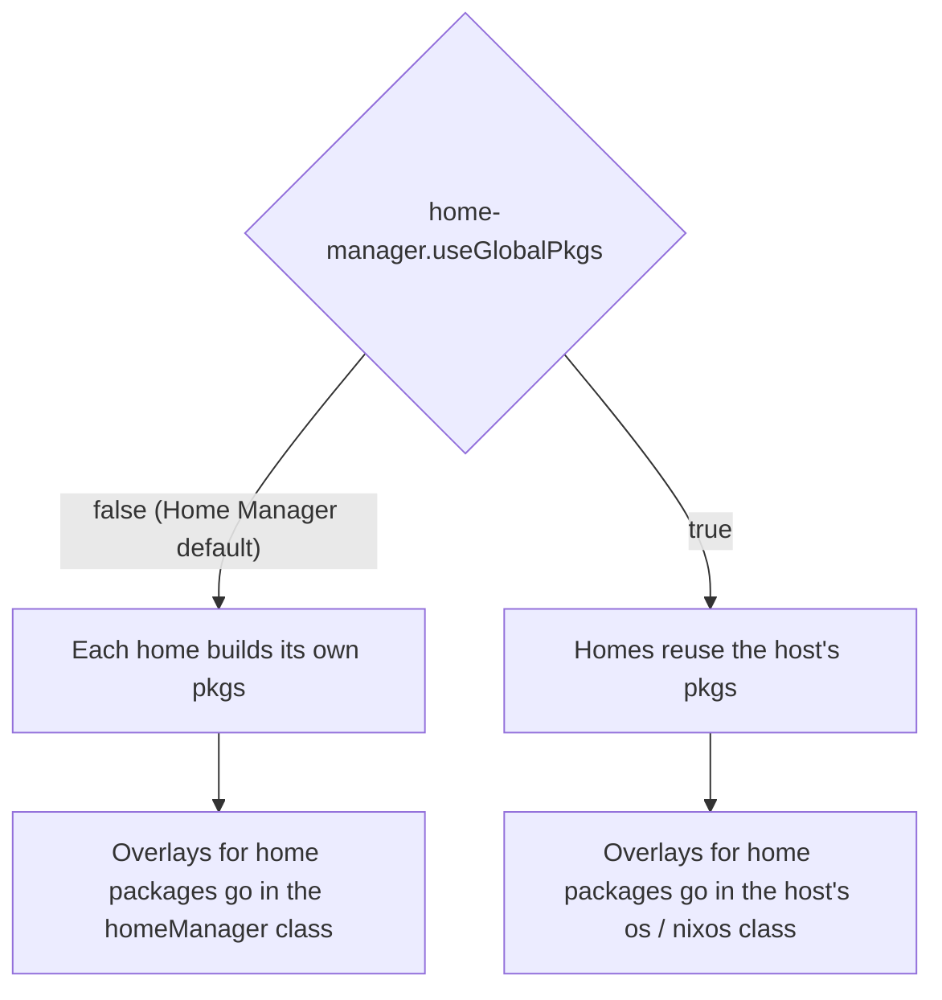

import { Aside, Steps } from '@astrojs/starlight/components';

<Aside title="Den does not own nixpkgs">
Den does not wrap nixpkgs. Every host still builds its package set through the
ordinary NixOS / nix-darwin `nixpkgs` module, and every home through Home
Manager's. What den adds is **where** you write the configuration: in aspects,
so an overlay can travel with the feature that needs it. Each den-specific
behaviour on this page was checked with a den test before it was written down.
</Aside>

## The vocabulary

<Aside type="note" title="Overlay">
An **overlay** is a function `final: prev: { … }` that adds or replaces
packages in a package set. `prev` is the set before your overlay, `final` the
set after all overlays. nixpkgs applies a list of them in order:
`nixpkgs.overlays = [ overlayA overlayB ];`. Flakes such as `rust-overlay`
publish one as `inputs.<flake>.overlays.default`.
</Aside>

<Aside type="note" title="Channel">
A **channel** is a branch of nixpkgs: `nixos-26.05` (stable), `nixos-unstable`,
`master`. In a flake each one is a separate input, for example
`inputs.nixpkgs` and `inputs.nixpkgs-unstable`. A host is *built* from one
channel. Packages from another channel are pulled in as a second package set.
</Aside>

<Aside type="note" title="useGlobalPkgs">
Home Manager, used as a NixOS or darwin module, normally builds a separate
package set for every user. `home-manager.useGlobalPkgs = true` makes every
user reuse the host's `pkgs` instead. That saves evaluation time, but it changes
where overlays have to go ([below](#home-manager-own-pkgs-or-the-hosts)).
</Aside>

## An overlay on one host

An overlay is plain NixOS configuration, so it goes in a class module:

```nix
{ inputs, ... }:
{
  den.aspects.igloo.nixos = { pkgs, ... }: {
    nixpkgs.overlays = [ inputs.rust-overlay.overlays.default ];
    environment.systemPackages = [ pkgs.rust-bin.stable.latest.default ];
  };
}
```

A remote flake's overlay and your own local overlay are used the same way. To
apply it everywhere, put it on an aspect that every host includes:

```nix
{ den, inputs, ... }:
{
  den.aspects.my-overlays.os.nixpkgs.overlays = [
    inputs.rust-overlay.overlays.default
    (final: prev: { my-tool = final.callPackage ./pkgs/my-tool.nix { }; })
  ];

  den.schema.host.includes = [ den.aspects.my-overlays ];
}
```

`os` writes to `nixos` and `darwin` alike. `den.default.includes` works too,
but it also reaches every user and home, so the host schema is the narrower
choice for a host-level setting.

<Aside type="caution" title="perSystem pkgs does not reach hosts">
A flake-parts `perSystem._module.args.pkgs = import inputs.nixpkgs { overlays = …; }`
configures the `pkgs` of `perSystem` (packages, devShells, checks). A den host
is instantiated with its modules only, and its `nixpkgs` module builds its own
package set. Overlays for hosts therefore go in `nixpkgs.overlays`, as above.
</Aside>

## Overlays contributed by the aspects that need them

An overlay listed centrally stays applied after the aspect that needed it is
removed. The alternative is a quirk: each aspect contributes its overlays under
a `nixpkgs-overlays` key, and one consumer per class applies whatever was
collected. The full recipe is in
[Quirk Recipes](/guides/quirk-recipes/#overlays-contributed-by-the-aspects-that-need-them).
The short version:

```nix
den.quirks.nixpkgs-overlays.description = "nixpkgs overlays collected from aspects";

den.aspects.rust.nixpkgs-overlays = _: [ inputs.rust-overlay.overlays.default ];

den.aspects.nixpkgs-overlays = {
  os = { nixpkgs-overlays, lib, ... }: {
    nixpkgs.overlays = lib.unique nixpkgs-overlays;
  };
  homeManager = { nixpkgs-overlays, lib, ... }: {
    nixpkgs.overlays = lib.unique nixpkgs-overlays;
  };
};
den.default.includes = [ den.aspects.nixpkgs-overlays ];
```

<Aside type="caution" title="Wrap the list: `_: [ overlay ]`">
Den calls a function-valued quirk entry with the scope's context. An overlay is
a function, so an unwrapped `nixpkgs-overlays = [ overlay ];` is called
with the context and the consumer receives an attribute set. Evaluation then
stops inside nixpkgs with `attempt to call something which is not a function but
a set`. Write `_: [ overlay ]`, or `{ host, ... }: [ … ]` when the list depends
on context.
</Aside>

## Home Manager: own pkgs or the host's

Which package set a home uses decides where its overlays must be:



| | Host overlay visible in the home | Home's `nixpkgs.overlays` |
|---|---|---|
| **own pkgs** (default) | no | applied |
| **`useGlobalPkgs = true`** | yes | ignored, with a Home Manager warning |

Den does not set `useGlobalPkgs`. Set it on the host like any other option:

```nix
den.aspects.igloo.nixos.home-manager.useGlobalPkgs = true;
```

Under `useGlobalPkgs`, an overlay a *user* aspect contributes must reach the
host. With the quirk above, a policy on the user scope exposes the user's
`nixpkgs-overlays` up to the host, so the host's consumer includes them (see
[the worked example](#worked-example-a-multi-channel-fleet)).

A standalone home (`den.homes.<system>.<name>`) has no host. Its base package
set is the home's `pkgs` option, `inputs.nixpkgs.legacyPackages.<system>` by
default, and `nixpkgs.overlays` in its `homeManager` class is applied on top:

```nix
den.homes.x86_64-linux.tux.pkgs = import inputs.nixpkgs {
  system = "x86_64-linux";
  overlays = [ inputs.rust-overlay.overlays.default ];
};
```

## Stable and unstable together

There are three ways to mix channels, depending on how much of the system should
move.

### A second package set as `pkgs.unstable`

Most flakes want the host on stable and a few packages from unstable. An
overlay adds the unstable set as an attribute of `pkgs`:

```nix
{ den, inputs, ... }:
{
  den.aspects.unstable-packages.os.nixpkgs.overlays = [
    (final: _prev: {
      unstable = import inputs.nixpkgs-unstable {
        inherit (final.stdenv.hostPlatform) system;
        inherit (final) config;
      };
    })
  ];
  den.schema.host.includes = [ den.aspects.unstable-packages ];

  den.aspects.igloo.nixos = { pkgs, ... }: {
    environment.systemPackages = [ pkgs.git pkgs.unstable.helix ];
  };
}
```

`inherit (final) config` passes the host's nixpkgs config to the second set, so
an unfree package allowed with
[`den.batteries.unfree`](/reference/batteries/#denbatteriesunfree) is
also allowed in `pkgs.unstable`. With `useGlobalPkgs = true`, homes see
`pkgs.unstable` as well. Without it, add the same overlay in the
`homeManager` class, or contribute it through the quirk.

<Aside type="tip">
The same pattern gives you `pkgs.master` from a `nixpkgs-master` input,
`pkgs.nur` from NUR, or `pkgs.local` for your flake's own packages.
</Aside>

### A module argument instead

If you'd rather not add to `pkgs`, pass the second set as its own module
argument. This mirrors how
[`den.batteries.inputs'`](/reference/batteries/#denbatteriesinputs) works:

```nix
{ den, inputs, ... }:
let
  unstableFor = { host, ... }: {
    _module.args.unstable = import inputs.nixpkgs-unstable { inherit (host) system; };
  };
in
{
  den.aspects.pkgs-unstable = {
    os = unstableFor;
    homeManager = unstableFor;
  };
  den.default.includes = [ den.aspects.pkgs-unstable ];

  den.aspects.igloo.nixos = { unstable, ... }: {
    environment.systemPackages = [ unstable.helix ];
  };
  den.aspects.tux.homeManager = { unstable, ... }: {
    home.packages = [ unstable.helix ];
  };
}
```

This set has its own nixpkgs config. Allow unfree packages in the `import`
call if you need them.

### A whole host on another channel

To move an entire host, change what builds it. `instantiate` is an option of
the **host entity** (not of its aspect). It defaults to
`inputs.nixpkgs.lib.nixosSystem` for `nixos` hosts:

```nix
den.hosts.x86_64-linux.igloo = {
  instantiate = inputs.nixpkgs-unstable.lib.nixosSystem;
  # keep Home Manager on the matching release
  home-manager.module = inputs.home-manager-unstable.nixosModules.home-manager;
};
```

To pick the channel by name, see the [worked example](#worked-example-a-multi-channel-fleet).

## Patching nixpkgs

A patch that hasn't been merged, or a backport, means building nixpkgs itself
from a patched source. Apply the patches with `applyPatches`, load the patched
tree's flake, and give its `nixosSystem` to the host:

```nix
{ inputs, ... }:
let
  # the machine that evaluates the flake, not necessarily the target
  pkgs = inputs.nixpkgs.legacyPackages.x86_64-linux;

  src = pkgs.applyPatches {
    name = "nixpkgs-patched";
    src = inputs.nixpkgs;
    patches = [
      (pkgs.fetchpatch {
        url = "https://github.com/NixOS/nixpkgs/pull/<number>.diff";
        hash = "sha256-…";
      })
      ./patches/my-fix.patch
    ];
  };

  nixpkgs-patched = (import "${src}/flake.nix").outputs {
    self = nixpkgs-patched // { outPath = src; };
  };
in
{
  den.hosts.x86_64-linux.igloo.instantiate = nixpkgs-patched.lib.nixosSystem;
}
```

The host's `pkgs` and its NixOS modules both come from the patched tree. Other
hosts keep the unpatched input.

<Aside type="caution" title="On the host, not the aspect">
`den.aspects.igloo.instantiate = …` is **silently ignored**: `instantiate` is
not an aspect key, and den does not report the unused key. It has to be set on
`den.hosts.<system>.<name>`, or through `den.schema.host` for many hosts.
</Aside>

<Aside type="note">
`applyPatches` produces a derivation, and loading `flake.nix` from it is
import-from-derivation: evaluating the host first builds the patched source.
Builders that disallow IFD (`allow-import-from-derivation = false`) reject it.
Patching a *package* instead of nixpkgs needs no IFD: override the package in
an overlay with
`prev.foo.overrideAttrs (old: { patches = (old.patches or [ ]) ++ [ ./fix.patch ]; })`.
</Aside>

## Unfree and insecure packages

nixpkgs refuses to evaluate unfree packages, and packages marked insecure,
unless you allow them. Den's batteries allow them by name from the aspect that
uses them, so the permission goes away with the aspect:

```nix
den.aspects.diagrams = {
  includes = [ (den.batteries.unfree [ "drawio" ]) ];
  homeManager = { pkgs, ... }: { home.packages = [ pkgs.drawio ]; };
};

den.aspects.legacy-client.includes = [
  (den.batteries.insecure [ "openssl-1.1.1w" ])
];
```

Several aspects can each include the battery. The names from all of them are
merged into one list on the host, so allowing `unrar` in one aspect and
`vscode` in another permits both.

The batteries write `nixpkgs.config.allowUnfreePredicate` and
`nixpkgs.config.permittedInsecurePackages` for each class. Included from a user
aspect, the names are allowed on the host too, which is what a home needs under
`useGlobalPkgs`. See
[Batteries](/reference/batteries/#denbatteriesunfree) for details.

<Aside type="tip">
If you'd rather allow every unfree package, skip the battery and set
`nixpkgs.config.allowUnfree = true` in the `os` class (and in `homeManager`
when homes build their own pkgs).
</Aside>

## Worked example: a multi-channel fleet

This is adapted from a production den flake with a few dozen hosts. Names are
generic, and the structure is kept.

<Steps>

1. **Pick each host's channel by name**

    The host schema gains a `channel` option. The builder and the matching Home
    Manager module are derived from it, with `mkDefault` so a single host can
    still override them:

    ```nix
    { inputs, ... }:
    let
      channels = {
        nixos-stable = {
          nixosSystem = inputs.nixpkgs.lib.nixosSystem;
          hmModule = inputs.home-manager.nixosModules.home-manager;
        };
        nixos-unstable = {
          nixosSystem = inputs.nixpkgs-unstable.lib.nixosSystem;
          hmModule = inputs.home-manager-unstable.nixosModules.home-manager;
        };
        nixpkgs-master = {
          nixosSystem = inputs.nixpkgs-master.lib.nixosSystem;
          hmModule = inputs.home-manager-master.nixosModules.home-manager;
        };
      };
    in
    {
      den.schema.host = { config, lib, ... }: {
        options.channel = lib.mkOption {
          type = lib.types.enum (builtins.attrNames channels);
          default = "nixos-unstable";
        };
        config = {
          instantiate = lib.mkDefault channels.${config.channel}.nixosSystem;
          home-manager.module = lib.mkDefault channels.${config.channel}.hmModule;
        };
      };

      den.hosts.x86_64-linux.media-server.channel = "nixpkgs-master";
    }
    ```

    The source flake also has darwin entries (`darwinSystem`, the darwin Home
    Manager module) keyed on `config.class`.

2. **One aspect owns the package set**

    A single `nixpkgs` aspect, included by every host, holds the shared
    config, the base overlays and both consumers:

    ```nix
    { inputs, withSystem, ... }:
    let
      config.allowUnfree = true;
    in
    {
      den.quirks.nixpkgs-overlays.description = "nixpkgs overlays collected from aspects";

      den.aspects.nixpkgs = {
        nixpkgs-overlays = _: [
          # this flake's own packages, as pkgs.local
          (final: _prev: {
            local = withSystem final.stdenv.hostPlatform.system ({ config, ... }: config.packages);
          })
          # pkgs.unstable, as in the section above
          (final: _prev: {
            unstable = import inputs.nixpkgs-unstable {
              inherit (final.stdenv.hostPlatform) system;
              config.allowUnfree = true;
            };
          })
          # version bumps and patched builds of individual packages
          (import ./overlays/modifications.nix { inherit inputs; })
        ];

        os = { nixpkgs-overlays, lib, ... }: {
          nixpkgs = {
            inherit config;
            overlays = lib.unique nixpkgs-overlays;
          };
        };

        homeManager = { host, nixpkgs-overlays, lib, ... }:
          lib.mkIf (!host.sharedHomePkgs) {
            nixpkgs = {
              inherit config;
              overlays = lib.unique nixpkgs-overlays;
            };
          };
      };
    }
    ```

    The `homeManager` half stands down on hosts that share their package set,
    because Home Manager ignores `nixpkgs.*` there.

    <Aside type="note" title="Why not `self.overlays.default`?">
    The source flake publishes the same `local` overlay as
    `self.overlays.default`. Its comments record that referencing that flake
    output from inside a quirk entry recursed infinitely, because it re-enters
    the flake's `outputs`. The overlay is rebuilt from the per-system packages
    instead.
    </Aside>

3. **Aspects bring their own overlays**

    Everything else is contributed by the aspect that uses it, wrapped in `_:`.
    A language aspect brings its toolchain overlay, a gaming aspect its
    compatibility-layer overlay, and a CPU aspect patches one package's build:

    ```nix
    den.aspects.rust = {
      nixpkgs-overlays = _: [ inputs.fenix.overlays.default ];
      homeManager = { pkgs, ... }: {
        home.packages = [ (pkgs.fenix.complete.withComponents [ "cargo" "clippy" "rustc" ]) ];
      };
    };

    den.aspects.cpu-amd.nixpkgs-overlays = _: [
      (_final: prev: {
        ucodenix = prev.ucodenix.overrideAttrs (old: {
          nativeBuildInputs = (old.nativeBuildInputs or [ ]) ++ [ prev.jql ];
        });
      })
    ];
    ```

    A host without the `rust` aspect never applies the `fenix` overlay.

4. **Shared package sets: project user overlays to the host**

    A host flag turns `useGlobalPkgs` on. When it is set, a policy exposes each
    user's overlays to the host's consumer, so `rust` included on a *user* still
    reaches the one package set that user's home now uses:

    ```nix
    { den, lib, ... }:
    {
      den.schema.host = { lib, ... }: {
        options.sharedHomePkgs = lib.mkOption {
          type = lib.types.bool;
          default = false;
        };
      };

      den.aspects.home-manager-shared.os = { host, ... }: {
        home-manager.useGlobalPkgs = host.sharedHomePkgs;
        home-manager.useUserPackages = true;
      };
      den.schema.host.includes = [ den.aspects.home-manager-shared ];

      den.policies.project-user-overlays = { user, host, ... }:
        lib.optionals host.sharedHomePkgs [
          (den.lib.policy.pipe.from "nixpkgs-overlays" [ den.lib.policy.pipe.expose ])
        ];
      den.schema.user.includes = [ den.policies.project-user-overlays ];
    }
    ```

    On hosts without the flag the policy returns nothing, and each home keeps
    collecting its own overlays. The source flake declares the flag as a typed
    per-aspect setting ([Aspect Settings](/guides/aspect-settings/)). A plain
    host option works the same way.

</Steps>

## See also

- [Quirk Recipes](/guides/quirk-recipes/): the overlay recipe in full, plus other contributor/consumer patterns
- [Home Environments](/guides/home-manager/): enabling Home Manager, custom Home Manager modules, standalone homes
- [Batteries](/reference/batteries/): `unfree`, `insecure`, `inputs'`, `self'`
- [Schema](/reference/schema/): the host's `instantiate` option and its defaults
