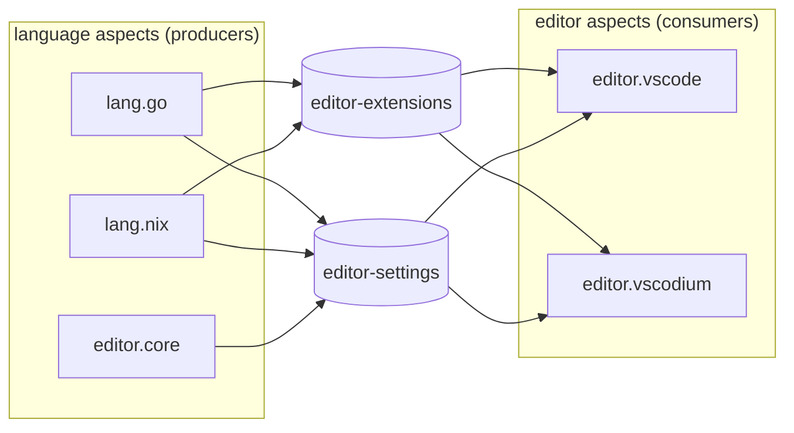

import { Aside } from '@astrojs/starlight/components';

<Aside title="Where these come from" icon="github">
Adapted from a production den flake. Each recipe was evaluated against den
with a test before it went on this page. The mechanics are covered in the
[Quirks & Pipes guide](/guides/quirks/).
</Aside>

These recipes share one shape. Many small aspects each **contribute** a piece
of data under a quirk key, and one aspect **consumes** the combined list. The
contributors never name the consumer, and the consumer never lists the
contributors. What is included decides what gets collected.

## Language aspects that configure every editor

### The problem

A "Go" aspect wants three things: the Go toolchain on the user's `PATH`, the Go
extension in the user's editor, and Go-specific editor settings. The toolchain
is ordinary `homeManager` config. The editor parts are awkward:

- if the Go aspect writes `programs.vscode.*` directly, it only works for
  VSCode, and a second editor (VSCodium, a VSCode fork) needs a second copy;
- if the editor aspect lists every language, adding a language means editing
  the editor.

<Aside type="note" title="VSCode extensions and settings">
VSCode's behaviour comes from **extensions** (packages that add language
support, formatters, debuggers) and **user settings** (one JSON object of
keys like `"editor.tabSize"`). Home Manager exposes both as
`programs.vscode.profiles.default.extensions` (a list of packages) and
`.userSettings` (an attrset rendered to `settings.json`). Several VSCode forks
have Home Manager modules with the same shape.
</Aside>

### The recipe

Declare two quirks, one per kind of editor data:

```nix
den.quirks.editor-extensions.description = "Editor extension packages";
den.quirks.editor-settings.description = "Editor settings attrsets";
```

Each language aspect installs its toolchain and **emits** editor data, without
knowing which editor will read it:

```nix
den.aspects.lang.go = {
  homeManager = { pkgs, ... }: {
    programs.go.enable = true;
    home.packages = [ pkgs.gopls pkgs.gotools ];
  };

  editor-extensions = { pkgs, ... }: [ pkgs.vscode-extensions.golang.go ];

  editor-settings = [ { "go.useLanguageServer" = true; } ];
};

den.aspects.lang.nix = {
  homeManager = { pkgs, ... }: { home.packages = [ pkgs.nixd pkgs.nixfmt ]; };

  editor-extensions = { pkgs, ... }: [ pkgs.vscode-extensions.jnoortheen.nix-ide ];

  editor-settings = { pkgs, lib, ... }: [ {
    "nix.enableLanguageServer" = true;
    "nix.serverPath" = lib.getExe pkgs.nixd;
    "[nix]"."editor.formatOnSave" = true;
  } ];
};
```

Settings that are not language-specific go in a shared core aspect the same
way:

```nix
den.aspects.editor.core.editor-settings = [ {
  "editor.rulers" = [ 80 120 ];
  "files.trimTrailingWhitespace" = true;
  "telemetry.telemetryLevel" = "off";
} ];
```

Each editor aspect **consumes** both quirks:

```nix
den.aspects.editor.vscode.homeManager =
  { editor-settings, editor-extensions, lib, ... }: {
    programs.vscode = {
      enable = true;
      profiles.default = {
        userSettings = lib.mkMerge editor-settings;
        extensions = lib.unique (lib.flatten editor-extensions);
      };
    };
  };
```

A second editor aspect with the same body (`programs.vscodium`, or any other
fork) reads the same two lists. A role aspect then picks what a user gets:

```nix
den.aspects.roles.dev-gui.includes = with den.aspects; [
  editor.core
  editor.vscode
  lang.go
  lang.nix
];

den.aspects.tux.includes = [ den.aspects.roles.dev-gui ];
```



Every producer feeds every consumer through the two quirks, and neither side
names the other.

Adding `lang.rust` to the role adds its toolchain, its extension and its
settings to **every** included editor. Adding an editor gives it every
included language. Neither edit touches the other side.

### Why it works

- **`{ pkgs, ... }:` quirk values.** `pkgs` is not scope context, so these
  values are [config-dependent thunks](/guides/quirks/#config-dependent-thunks).
  Den resolves them inside the consuming Home Manager evaluation, with that
  evaluation's `pkgs`. The extension list therefore uses the same package set
  (and overlays) as the rest of the home.
- **`lib.mkMerge editor-settings`.** Each list entry becomes one module
  definition of `userSettings`, so the module system merges them key by key.
  Home Manager types `userSettings` as JSON, so lists (like `editor.rulers`)
  from several aspects are concatenated. Two aspects setting the **same scalar
  key** to different values is a conflict error, which is what you want.
  Use `lib.mkDefault` in the core aspect for values a language may override.
- **`lib.unique (lib.flatten …)`.** Each value is a list, so the pool is a list
  of lists. `unique` drops an extension that two languages both requested.

## Every aspect declares what it persists

### The problem

<Aside type="note" title="Impermanence">
An **impermanent** system wipes its root filesystem at every boot and keeps
only an explicit list of paths on a persistent volume. The
[impermanence](https://github.com/nix-community/impermanence) module takes
that list as `environment.persistence."/persist"` (system paths) and
`home.persistence."/persist"` (per-user paths).
</Aside>

The list of paths to keep is the sum of what every enabled service needs:
`/var/lib/docker` for Docker, `/etc/ssh` for SSH host keys,
`~/.config/VSCodium` for the editor. Kept in one central list, it drifts:
removing an aspect leaves its paths behind, and adding one forgets them.

### The recipe

Each aspect declares its own paths next to the config that needs them:

```nix
den.quirks.persist.description = "System paths to keep across reboots";
den.quirks.persistHome.description = "Home paths to keep across reboots";

den.aspects.docker = {
  nixos.virtualisation.docker.enable = true;
  persist.directories = [ "/var/lib/docker" ];
};

den.aspects.ssh = {
  nixos.services.openssh.enable = true;
  persist = {
    directories = [ "/etc/ssh" ];
    files = [ "/etc/machine-id" ];
  };
};

den.aspects.editor.vscode.persistHome.directories = [ ".config/Code" ".vscode" ];
```

One collector per level turns the pool into the impermanence option:

```nix
den.aspects.impermanence = {
  nixos = { persist, lib, ... }: {
    environment.persistence."/persist" = {
      directories = lib.unique (lib.concatMap (e: e.directories or [ ]) persist);
      files = lib.unique (lib.concatMap (e: e.files or [ ]) persist);
    };
  };
  homeManager = { persistHome, lib, ... }: {
    home.persistence."/persist" = {
      directories = lib.unique (lib.concatMap (e: e.directories or [ ]) persistHome);
      files = lib.unique (lib.concatMap (e: e.files or [ ]) persistHome);
    };
  };
};
```

Include `impermanence` on the hosts (and users) that wipe their root. On a
host without it, the `persist` keys are still collected but nobody reads them,
so the same service aspects work on both kinds of host.

The same shape works for a second list with a different lifetime, such as a
`cache` quirk collected into a volume that is not backed up.

## Overlays contributed by the aspects that need them

### The problem

<Aside type="note" title="Overlays and useGlobalPkgs">
A nixpkgs **overlay** is a function that adds or replaces packages in the
package set. An aspect that uses a package from outside nixpkgs (an extension
marketplace, a patched build) needs the overlay that provides it.
Home Manager's `home-manager.useGlobalPkgs = true` makes every user share the
host's package set instead of building their own, and then user-level
overlays have to be applied on the **host**.
</Aside>

### The recipe

Aspects contribute overlays to a quirk, and one consumer per class applies
them:

```nix
den.quirks.nixpkgs-overlays.description = "nixpkgs overlays collected from aspects";

# wrapped in `_:` -- see the caution below
den.aspects.editor.core.nixpkgs-overlays = _: [ inputs.nix-vscode-extensions.overlays.default ];

den.aspects.nixpkgs-overlays = {
  nixos = { nixpkgs-overlays, lib, ... }: {
    nixpkgs.overlays = lib.unique nixpkgs-overlays;
  };
  homeManager = { nixpkgs-overlays, lib, ... }: {
    nixpkgs.overlays = lib.unique nixpkgs-overlays;
  };
};
```

<Aside type="caution" title="Wrap function values">
Den calls a function-valued quirk entry with the scope's context when it can
(that is how `{ host, ... }:` records work). An overlay is a function too, so
a bare `[ overlay ]` gets called with the context instead of reaching the
consumer, and evaluation fails with `attempt to call something which is not
a function`. Wrap the list in a function: `_: [ overlay ]` (or
`{ inputs', ... }: [ … ]` when you need context). Den calls the wrapper, and the
overlays inside pass through untouched.
</Aside>

Put the consumer in `den.default.includes` so every host and home has one.
By default each home collects its own overlays. When a host shares its
package set, a policy **exposes** each user's overlays up to the host, but only
on hosts where sharing is on:

```nix
den.policies.project-user-overlays = { user, host, ... }:
  lib.optionals host.shareHomePkgs [
    (den.lib.policy.pipe.from "nixpkgs-overlays" [ den.lib.policy.pipe.expose ])
  ];

den.schema.user.includes = [ den.policies.project-user-overlays ];
```

`host.shareHomePkgs` here is a user-defined host option (see
[Aspect Settings](/guides/aspect-settings/) for a typed way to declare such
flags). The policy returns no effects on other hosts, so their users' overlays
stay in their homes.

<Aside type="caution">
Under `useGlobalPkgs`, Home Manager ignores a home's `nixpkgs.overlays` (with
a warning) and asserts when a home sets both `nixpkgs.config` and
`nixpkgs.overlays`. Gate the `homeManager` half of the consumer off on those
hosts. The [nixpkgs guide](/guides/nixpkgs/) walks through both modes.
</Aside>

## Designing your own

The three recipes use the same checklist:

1. **Name the data, not the consumer.** `editor-settings`, not
   `vscode-settings`: the key describes what the producer knows.
2. **Emit lists.** Each producer emits a list and each consumer flattens,
   dedups or merges. Lists are what let many producers contribute.
3. **Merge in the consumer.** The consumer chooses the merge rule
   (`mkMerge`, `unique`, `concatMap`). Producers stay plain data.
4. **Use a policy only when data must move.** Everything here is same-scope
   except the overlay expose. When data has to cross scopes, add a
   [pipe](/guides/quirks-cross-scope/) and nothing else.

## See also

- [Quirks & Pipes guide](/guides/quirks/) -- producing, consuming, scoping, thunks
- [Cross-Scope Pipes](/guides/quirks-cross-scope/) -- `expose`, `collect`, `broadcast`
- [den.quirks reference](/reference/quirks/) -- the pipe builder API
- [Aspect Settings](/guides/aspect-settings/) -- typed per-host tunables
- [Case Study: Kubernetes](/tutorials/case-study-kubernetes/) -- quirks across hosts and a cluster
