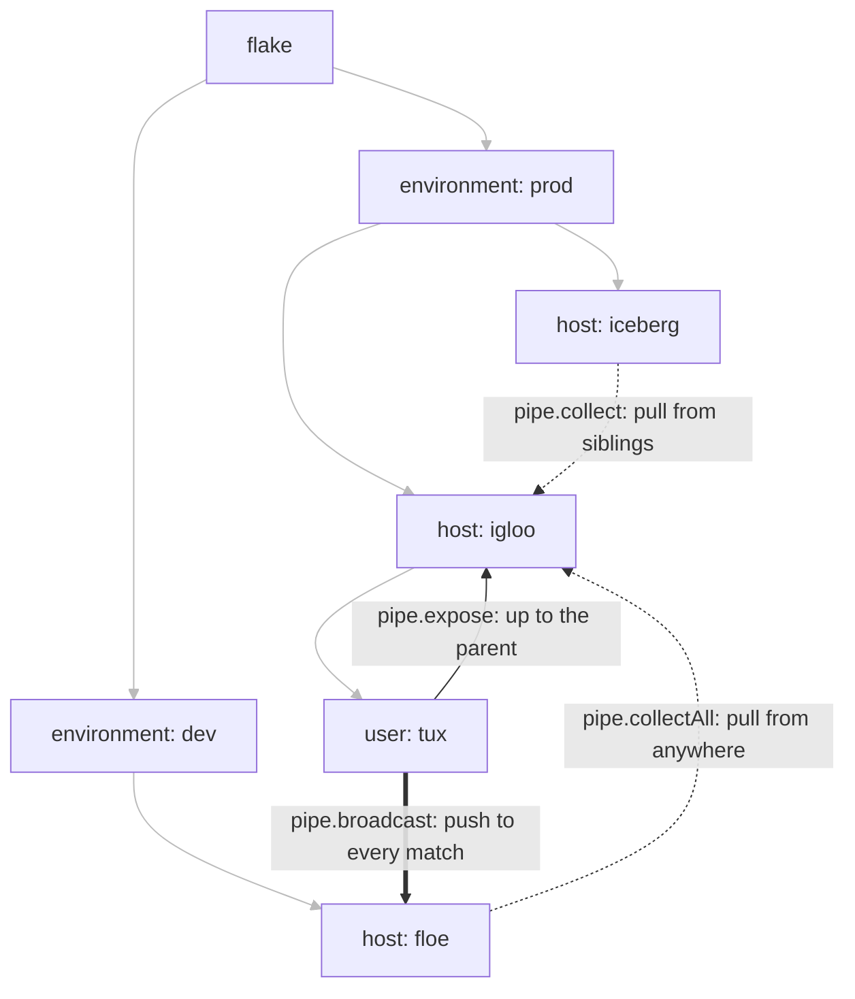

import { Aside } from '@astrojs/starlight/components';

<Aside title="Source" icon="github">
[`templates/ci/modules/public-api/pipe-scope.nix`](https://github.com/denful/den/blob/main/templates/ci/modules/public-api/pipe-scope.nix) --
[`templates/ci/modules/public-api/pipe-broadcast.nix`](https://github.com/denful/den/blob/main/templates/ci/modules/public-api/pipe-broadcast.nix)
</Aside>

By default a quirk value stays in the scope that emitted it (see
[Scoping](/guides/quirks/#scoping-who-sees-what)). This page covers the pipe
stages that move data between scopes. It assumes the basics from the
[Quirks & Pipes guide](/guides/quirks/).

| Stage | Direction | Use it for |
|---|---|---|
| `pipe.expose` | child → parent | a user's data reaching its host |
| `pipe.collect` | pull from siblings | hosts in one environment seeing each other |
| `pipe.collectAll` | pull from every matching scope | fleet-wide rosters, cluster-level aggregation |
| `pipe.broadcast` | push to every matching scope | per-user meshes, hub-and-spoke |



Grey edges are the scope tree; labelled edges are the pipe stages, each drawn
from the scope that holds the data to the scope that reads it.

## Upward: `pipe.expose`

Push child-scope data to the parent. Without this, a user's emits stay in
the user scope (see [Scoping](/guides/quirks/#scoping-who-sees-what)). A user's preferences
reach the host:

```nix
den.quirks.prefs = { description = "User preferences"; };

den.aspects.tux = {
  prefs = [{ editor = "vim"; }];
};

den.aspects.igloo = {
  includes = [ den.aspects.host-consumer ];
};

den.aspects.host-consumer = {
  nixos = { prefs, lib, ... }: {
    networking.hostName =
      lib.concatMapStringsSep "-" (p: p.editor) prefs;
  };
};

den.policies.expose-prefs = { host, user, ... }:
  let inherit (den.lib.policy) pipe; in
  [ (pipe.from "prefs" [ pipe.expose ]) ];

den.default.includes = [ den.policies.expose-prefs ];
```

Result: host consumer sees `[{ editor = "vim"; }]`.

Exposed data merges with host-local data. If the host aspect also emits
`prefs`, consumers see both host-local and exposed user entries.

Transform stages run before expose:

```nix
pipe.from "items" [
  (pipe.filter (i: i.keep))
  (pipe.transform (i: { label = "x-${i.name}"; }))
  pipe.expose
]
```

## Lateral: `pipe.collect`

Harvest data from sibling scopes. Siblings are scopes sharing the same
parent in the scope tree. This is how you do cross-host aggregation:

```nix
den.hosts.x86_64-linux.igloo.users.tux = {};
den.hosts.x86_64-linux.iceberg.users.alice = {};

den.quirks.http-backends = {
  description = "HTTP backends";
};

den.aspects.iceberg = {
  http-backends = { addr = "10.0.0.2"; port = 80; };
};

den.aspects.igloo = {
  includes = [ den.aspects.lb-consumer ];
  http-backends = { addr = "10.0.0.1"; port = 8080; };
};

den.aspects.lb-consumer = {
  nixos = { http-backends, lib, ... }: {
    environment.etc."lb/backends".text =
      lib.concatMapStringsSep "\n" (b: "${b.addr}:${toString b.port}")
        http-backends;
  };
};

den.policies.fleet-backends = { host, ... }:
  let inherit (den.lib.policy) pipe; in
  [ (pipe.from "http-backends" [
      (pipe.collect ({ host, ... }: true))
    ])
  ];

den.schema.host.includes = [ den.policies.fleet-backends ];
```

The predicate in `pipe.collect` filters which sibling scopes to harvest from.

<Aside type="caution" title="The predicate must name the scope's entity kind">
A scope is considered only when its **own** entity kind is a required
argument of the predicate. `({ host, ... }: true)` matches host scopes and
never user scopes (a user scope also has `host` in its context, but its kind
is `user`). A bare `(_: true)` names no kind, so it matches no entity scope
at all. To collect from other users, write `({ user, ... }: true)`.
</Aside>

"Siblings" follows the scope tree, which makes `collect` a natural boundary.
If hosts are resolved under a grouping entity (for example an `environment`
kind whose policy fans out to its hosts), a host's siblings are the hosts in
the **same** environment, so a `collect` scopes itself to that environment
without any predicate logic. Use `pipe.collectAll` when you want to cross
that boundary.

## Collect with provenance

Track where collected data came from:

```nix
pipe.from "http-backends" [
  (pipe.collect ({ host, ... }: true))
  pipe.withProvenance
]
```

Consumers receive `[{ value = <data>; source = <context>; }]` where `source`
is the full context attrset (`{ host = ...; }`) of the source scope.

## Collect with filtering

Stages after `pipe.collect` operate on the combined pool:

```nix
pipe.from "http-backends" [
  (pipe.collect ({ host, ... }: true))
  (pipe.filter (b: b.port != 8080))
]
```

## Fleet-wide pull: `pipe.collectAll`

`pipe.collectAll` is `pipe.collect` without the sibling restriction: it
harvests from every matching scope in the fleet. It is the right choice for a
record every host needs about every other host (an `/etc/hosts` roster), and
for an aggregating scope that sits above the hosts, such as a cluster or an
environment:

```nix
den.quirks.host-addrs.description = "Address records for every host";

den.aspects.addr-record.host-addrs =
  { host, ... }: { name = host.name; addr = host.addr; };

# every host sees every host, across environments
den.policies.collect-host-addrs = { host, ... }:
  let inherit (den.lib.policy) pipe; in
  [ (pipe.from "host-addrs" [ (pipe.collectAll ({ host, ... }: true)) ]) ];

den.schema.host.includes = [
  den.aspects.addr-record
  den.policies.collect-host-addrs
];

den.aspects.etc-hosts.nixos = { host-addrs, lib, ... }: {
  networking.extraHosts =
    lib.concatMapStringsSep "\n" (h: "${h.addr} ${h.name}") host-addrs;
};
```

The same stage works from a non-host scope: a policy taking `{ cluster, ... }`
with `(pipe.collectAll ({ host, ... }: true))` gives the cluster's own class
modules every host's records. (`host.addr` here is a user-defined
`den.schema.host` option.)

## Fleet-wide: `pipe.broadcast`

Push a scope's own pipe value to **every other scope** matching a predicate —
in one stage, in any direction (user→user, user→host, host→user, fleet-wide).
The push dual of `pipe.expose`: instead of one parent receiving, every matching
scope receives.

A common shape: every user publishes a device record, and every user's home
sees the whole fleet's roster:

```nix
den.hosts.x86_64-linux.igloo.users.tux = {};
den.hosts.x86_64-linux.iceberg.users.alice = {};

# Both users get a home-manager home (see the Home Manager guide):
den.schema.user.classes = lib.mkDefault [ "homeManager" ];

den.quirks.peer-dev = {
  description = "per-user device records";
};

den.aspects.tux = {
  peer-dev = [ { who = "tux@igloo"; } ];
  homeManager = { peer-dev, lib, ... }: {
    home.sessionVariables.PEERS =
      lib.concatStringsSep "," (map (p: p.who) peer-dev);
  };
};
den.aspects.alice = {
  peer-dev = [ { who = "alice@iceberg"; } ];
  homeManager = { peer-dev, lib, ... }: {
    home.sessionVariables.PEERS =
      lib.concatStringsSep "," (map (p: p.who) peer-dev);
  };
};

# Every user scope broadcasts its own peer-dev to all other user scopes.
den.policies.broadcast-peers = { host, user, ... }:
  let inherit (den.lib.policy) pipe; in
  [ (pipe.from "peer-dev" [ (pipe.broadcast ({ user, ... }: true)) ]) ];

den.schema.user.includes = [ den.policies.broadcast-peers ];
```

`PEERS` on both tux's and alice's homes now lists **both** users — each scope
sees its own emits plus everything broadcast to it. Transform stages before
`pipe.broadcast` apply to the value as it leaves; config-dependent thunks are
resolved against the *source* host's config when they cross hosts. Note the
asymmetry: a broadcaster pushes its own raw emits only — data exposed *up* into
it (e.g. a host broadcaster's users' `pipe.expose` data) does not ride along.

## Recipe: per-user mesh and hub

A broadcast predicate is an ordinary closure, so it can compare the receiving
scope against the sending one. This keeps each user's devices in a mesh of
their own (tux's hosts see tux's devices, never alice's):

```nix
den.policies.broadcast-sync-peers = { user, ... }:
  let
    inherit (den.lib.policy) pipe;
    srcUser = user.name;
  in
  [ (pipe.from "sync-peers" [
      (pipe.broadcast ({ user, ... }: user.name == srcUser))
    ]) ];
den.schema.user.includes = [ den.policies.broadcast-sync-peers ];
```

A policy can also decide *whether* to broadcast at all. Here, only the host
marked as the hub advertises itself, and every user scope receives it:

```nix
den.policies.broadcast-hub = { host, ... }:
  let inherit (den.lib.policy) pipe; in
  lib.optionals (host.isSyncHub or false) [
    (pipe.from "sync-peers" [ (pipe.broadcast ({ user, ... }: true)) ])
  ];
den.schema.host.includes = [ den.policies.broadcast-hub ];
```

A transform before the broadcast stamps the sender onto each record, which
the receiver would otherwise not know:

```nix
(pipe.from "shares" [
  (pipe.transform (e: e // { user = srcUser; }))
  (pipe.broadcast ({ host, ... }: host.isSyncHub or false))
])
```

## See also

- [Quirks & Pipes guide](/guides/quirks/) -- producing, consuming, scoping, transforms
- [den.quirks reference](/reference/quirks/) -- exact semantics of each stage
- [Quirk Recipes](/guides/quirk-recipes/) -- cross-cutting aspects built on quirks
- [Case Study: Kubernetes](/tutorials/case-study-kubernetes/) -- `collect` vs `collectAll` from a cluster scope
