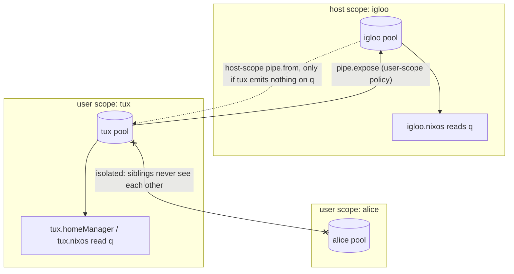

import { Aside, Steps } from '@astrojs/starlight/components';

<Aside title="Source" icon="github">
[`templates/ci/modules/public-api/pipes.nix`](https://github.com/denful/den/blob/main/templates/ci/modules/public-api/pipes.nix) --
[`templates/ci/modules/public-api/pipe-policy.nix`](https://github.com/denful/den/blob/main/templates/ci/modules/public-api/pipe-policy.nix) --
[`templates/ci/modules/public-api/pipe-scope.nix`](https://github.com/denful/den/blob/main/templates/ci/modules/public-api/pipe-scope.nix)
</Aside>

## Quick start: firewall ports

The classic example — multiple aspects declare firewall ports, one aspect
opens them.

<Steps>

1. **Declare the quirk**

    ```nix
    den.quirks.firewall = {
      description = "Firewall port declarations";
    };
    ```

2. **Produce data**

    Any aspect can emit data on the `firewall` key. Producers don't need
    to know who consumes it:

    ```nix
    den.aspects.nginx = {
      nixos.services.nginx.enable = true;
      firewall = { ports = [ 80 443 ]; };
    };

    den.aspects.postgres = {
      nixos.services.postgresql.enable = true;
      firewall = { ports = [ 5432 ]; };
    };
    ```

3. **Consume data**

    A class module receives all firewall entries as a list by naming the
    quirk in its function arguments:

    ```nix
    den.aspects.networking = {
      nixos = { firewall, lib, ... }: {
        networking.firewall.allowedTCPPorts =
          lib.concatMap (f: f.ports or []) firewall;
      };
    };
    ```

4. **Include everything**

    ```nix
    den.aspects.igloo = {
      includes = [
        den.aspects.nginx
        den.aspects.postgres
        den.aspects.networking
      ];
    };
    ```

    Result: `networking.firewall.allowedTCPPorts = [ 80 443 5432 ]`.

</Steps>

No pipe policy needed — same-scope aggregation works out of the box.
If no producers emit data, the consumer receives `[]`.

## Scoping: who sees what

Every entity resolves in its own **scope**: one per host, one per user on
that host, one per standalone home. A quirk value lands in the pool of the
scope whose aspect emitted it, and a consumer reads the pool of the scope
whose aspect it belongs to. The class does not matter. A `nixos` module on a
**user** aspect reads the user's pool, even though its config ends up in the
host's NixOS system.

With `den.hosts.x86_64-linux.igloo.users = { tux = { }; alice = { }; }`
and a quirk `q`:

| Emitted on | Read by | Sees | Why |
|---|---|---|---|
| `igloo` | `igloo.nixos` | igloo's values | same scope |
| `tux` | `tux.homeManager` or `tux.nixos` | tux's values | same scope |
| `tux` | `igloo.nixos` | **nothing** | user data stays in the user scope |
| `alice` | `tux.homeManager` | **nothing** | sibling scopes are isolated |
| `igloo` | `tux.homeManager` | **nothing**, unless a host policy binds the pipe (below) | host data does not flow down by default |



Solid arrows are how data moves; the dotted one is the conditional host-to-user
hand-off described below.

**User quirks never appear in the host's pool on their own.** To send them
up, add a policy with `pipe.expose` at user scope:

```nix
den.policies.expose-q = { user, ... }:
  [ (den.lib.policy.pipe.from "q" [ den.lib.policy.pipe.expose ]) ];
den.schema.user.includes = [ den.policies.expose-q ];
```

The host's pool is then its own values plus every exposing user's.

**Host values reach a user only through a host-scope pipe policy**, and only
for a user scope that emits nothing of its own on that quirk:

```nix
den.policies.bind-q = { host, ... }:
  [ (den.lib.policy.pipe.from "q" [ ]) ];   # even with no stages
den.schema.host.includes = [ den.policies.bind-q ];
```

With `bind-q`, `tux.homeManager` sees igloo's values. If tux's own aspects
also emit `q`, tux sees **only** its own values and the host's are not
merged in. When a user needs both, deliver the host data under a second name
(`pipe.as`) or read it from `host` directly.

Across hosts, and between users on different hosts, data moves only through
`pipe.collect`, `pipe.collectAll` and `pipe.broadcast` (see
[Cross-Scope Pipes](/guides/quirks-cross-scope/)).

## Pipe policies: filter, transform, fold

When you need to process data before consumers see it, use pipe policies.
All pipe stages are accessed via `den.lib.policy.pipe`.

### Filtering

Remove entries that don't match a predicate:

```nix
den.policies.tcp-only = { host, ... }:
  let inherit (den.lib.policy) pipe; in
  [ (pipe.from "firewall" [
      (pipe.filter (e: e.proto == "tcp"))
    ])
  ];

den.default.includes = [ den.policies.tcp-only ];
```

Given producers emitting `[{ port = 80; proto = "tcp"; } { port = 53; proto = "udp"; }]`,
consumers see only `[{ port = 80; proto = "tcp"; }]`.

### Transforming

Map each entry to a new shape:

```nix
den.policies.label-items = { host, ... }:
  let inherit (den.lib.policy) pipe; in
  [ (pipe.from "items" [
      (pipe.transform (i: { label = "x-${i.name}"; }))
    ])
  ];
```

### Folding

Reduce all entries to a single value:

```nix
den.policies.sum-nums = { host, ... }:
  let inherit (den.lib.policy) pipe; in
  [ (pipe.from "nums" [
      (pipe.fold (acc: n: acc + n) 0)
    ])
  ];
```

The consumer receives a single-element list: `[ 60 ]` for inputs `[ 10 20 30 ]`.

### Appending

Add a synthetic entry to the pool:

```nix
den.policies.add-default = { host, ... }:
  let inherit (den.lib.policy) pipe; in
  [ (pipe.from "items" [
      (pipe.append { name = "default"; })
    ])
  ];
```

### Replacing with `pipe.for`

Replace the entire list. At most one `pipe.for` per pipe per scope:

```nix
den.policies.reverse-items = { host, ... }:
  let inherit (den.lib.policy) pipe; in
  [ (pipe.from "items" [
      (pipe.for (vals: lib.reverseList vals))
    ])
  ];
```

### Chaining stages

Stages compose left-to-right:

```nix
pipe.from "items" [
  (pipe.filter (i: i.keep))
  (pipe.transform (i: { label = "x-${i.name}"; }))
]
```

## Cross-scope flow

Moving data between scopes -- `pipe.expose` (child to parent),
`pipe.collect` (siblings), `pipe.collectAll` (fleet-wide pull) and
`pipe.broadcast` (fleet-wide push) -- has its own page:
[Cross-Scope Pipes](/guides/quirks-cross-scope/).

## Targeted delivery with `pipe.to`

Route pipe data to specific aspects by identity:

```nix
den.policies.route-firewall = { host, ... }:
  let inherit (den.lib.policy) pipe; in
  [ (pipe.from "firewall" [
      (pipe.to [ den.aspects.networking ])
    ])
  ];
```

Only the named aspects receive the data. Other consumers of the same
pipe see the unmodified pool.

### Recipe: per-aspect secrets delivery

Combine `pipe.filter`, `pipe.append`, `pipe.for`, and `pipe.to` to
deliver a custom attrset to a specific aspect:

```nix
den.quirks.secrets = { description = "Secret paths"; };

den.policies.postgres-secrets = { host, ... }:
  let inherit (den.lib.policy) pipe; in
  [ (pipe.from "secrets" [
      (pipe.filter (_: false))          # discard the pool
      (pipe.append { db-password = "/run/secrets/pg-pass"; })
      (pipe.for (vs: [ (lib.mergeAttrsList vs) ]))  # merge; must stay a list
      (pipe.to [ den.aspects.postgres ])
    ])
  ];

den.schema.host.includes = [ den.policies.postgres-secrets ];
```

The consumer receives a one-element list holding the merged attrset:

```nix
den.aspects.postgres = {
  nixos = { secrets, ... }: {
    services.postgresql.settings.password_file =
      (builtins.head secrets).db-password;
  };
};
```

This pattern works because `pipe.for` replaces the list with its result, and
`pipe.to` delivers only to the named aspect. The function given to `pipe.for`
must return a **list**: returning the attrset itself fails with an error.

## Derived quirks with `pipe.as`

`pipe.as` renames pipe output, delivering data under a different quirk name.
This lets you create **derived quirks** — quirks with no native emitters,
populated entirely from other pipes:

```nix
den.quirks.backends = { description = "Backend addresses"; };
den.quirks.monitoring-targets = { description = "Monitoring targets"; };

den.aspects.web = {
  backends = [
    { addr = "10.0.0.1"; port = 80; }
    { addr = "10.0.0.2"; port = 443; }
  ];
};

den.aspects.monitor = {
  nixos = { monitoring-targets, ... }: {
    services.prometheus.scrapeConfigs = [{
      job_name = "backends";
      static_configs = [{ targets = monitoring-targets; }];
    }];
  };
};

den.policies.backends-to-monitoring = { host, ... }:
  let inherit (den.lib.policy) pipe; in
  [ (pipe.from "backends" [
      (pipe.transform (b: "${b.addr}:${toString b.port}"))
      (pipe.as "monitoring-targets")
    ])
  ];
```

The `monitor` aspect consumes `monitoring-targets` which has no native
emitters — it's entirely populated via `pipe.as` from `backends`. The
`web` aspect's data is transformed and renamed, while any direct consumers
of `backends` see the original data unmodified.

### Combining `pipe.as` with `pipe.collect`

Collect data across hosts, transform it, and deliver under a new name:

```nix
den.policies.collect-as-urls = { host, ... }:
  let inherit (den.lib.policy) pipe; in
  [ (pipe.from "http-addrs" [
      (pipe.collect ({ host, ... }: true))
      (pipe.transform (a: "http://${a.addr}:${toString a.port}"))
      (pipe.as "peer-urls")
    ])
  ];
```

### Combining `pipe.as` with `pipe.to`

Target specific aspects with renamed data:

```nix
den.policies.targeted-derived = { host, ... }:
  let inherit (den.lib.policy) pipe; in
  [ (pipe.from "raw-data" [
      (pipe.transform (v: "d-${v}"))
      (pipe.as "derived-data")
      (pipe.to [ den.aspects.targeted-consumer ])
    ])
  ];
```

<Aside type="caution">
`pipe.as` must target a different quirk than its source. Self-targeting
(`pipe.as "same-pipe"`) throws an error.
</Aside>

## Context-parametric producers

A quirk value can be a function of the scope's context (`host`, `user`,
`environment`, or any other bound entity). Den calls it at the **producing**
scope, before the value moves anywhere, so consumers and other hosts receive
a plain record:

```nix
den.aspects.node-exporter = {
  nixos.services.prometheus.exporters.node.enable = true;
  prometheus-targets = { host, ... }: {
    hostname = host.name;
    addr = host.addr;
    exporters = [ { job = "node"; port = 9100; } ];
  };
};
```

Each host that includes `node-exporter` emits a record about itself. A
`collect` on the monitoring host then gathers one record per peer. Only
arguments that the scope binds count as context. A function that also asks
for `config` (or any other module argument) is a config-dependent thunk,
described next.

## Config-dependent thunks

Quirk values can depend on the evaluated config of the class that produced
them — NixOS, nix-darwin, home-manager, or any registered class. Declare a
function taking `{ config, ... }` as the quirk value:

```nix
den.aspects.my-service = {
  nixos.services.my-service.enable = true;
  firewall = { config, ... }: {
    ports = [ config.services.my-service.port ];
  };
};
```

`config` is always the **producer's** config, wherever the value is consumed.
A quirk on a host aspect reads the host's NixOS config; a quirk on a user
aspect reads that user's home-manager config — even when a host's `nixos`
module consumes it through `pipe.expose`:

```nix
den.policies.expose-dev =
  { user, ... }: [ (den.lib.policy.pipe.from "dev" [ den.lib.policy.pipe.expose ]) ];
den.schema.user.includes = [ den.policies.expose-dev ];

# user-produced: `config` is tux's home-manager config
den.aspects.tux.dev = { config, ... }: [ "u:${config.home.username}" ];

# host-consumed: receives [ "u:tux" ]
den.aspects.igloo.nixos = { dev, ... }: {
  networking.domain = builtins.head dev;
};
```

A home-manager producer can also take `osConfig` to read the config of the
host it lives on:

```nix
den.aspects.tux.host-marks = { osConfig, ... }: [ "mark-${osConfig.networking.hostName}" ];
```

Local thunks are resolved lazily inside `evalModules`. Cross-host thunks
(via `pipe.collect` or `pipe.broadcast`) are resolved eagerly against the
source's config.

## See also

- [Quirks & Pipes explanation](/explanation/quirks-and-pipes/) — conceptual overview
- [den.quirks reference](/reference/quirks/) — option types and pipe builder API
- [Quirk Recipes](/guides/quirk-recipes/) — language aspects feeding editors, per-aspect persistence, shared overlays
- [Tests as examples](https://github.com/denful/den/tree/main/templates/ci/modules/public-api) — `pipes.nix`, `pipe-policy.nix`, `pipe-scope.nix`, `pipe-config-scope.nix`, `pipe-broadcast.nix`
