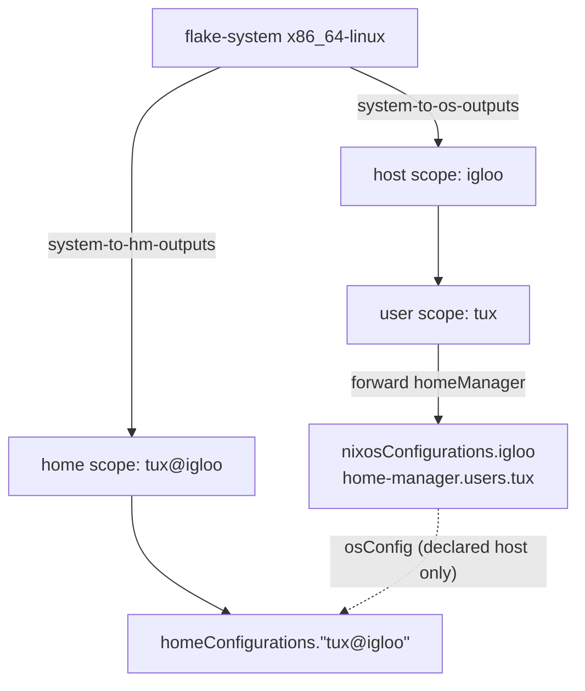

import { Aside, Steps } from '@astrojs/starlight/components';

<Aside title="Source" icon="github">
[`nix/lib/entities/home.nix`](https://github.com/denful/den/blob/main/nix/lib/entities/home.nix) --
[`modules/policies/flake.nix`](https://github.com/denful/den/blob/main/modules/policies/flake.nix) --
[`nix/lib/nh.nix`](https://github.com/denful/den/blob/main/nix/lib/nh.nix) --
[`templates/ci/modules/public-api/homes.nix`](https://github.com/denful/den/blob/main/templates/ci/modules/public-api/homes.nix)
</Aside>

A **standalone home** is a Home Manager configuration that is not part of any
NixOS or nix-darwin system. You activate it with the `home-manager` CLI (or
`nh home`), without root, on any machine that has Nix, including non-NixOS
Linux, macOS, or a NixOS host whose system config lives somewhere else.

In den a standalone home is an entity declared under `den.homes`. It is
configured by the same aspects as a host user, so one `den.aspects.tux` can
drive both `tux` on your NixOS laptop and `tux` on a work machine you don't
administer.

For Home Manager *inside* a host (`home-manager.users.<name>`), see
[Home Environments](/guides/home-manager/).

## Quick start

<Steps>

1. **Declare the home**

    ```nix
    den.homes.x86_64-linux.tux = { };
    ```

2. **Configure it through the user's aspect**

    ```nix
    den.default.homeManager.home.stateVersion = "25.11";
    den.default.includes = [ den.batteries.define-user ];

    den.aspects.tux.homeManager = { pkgs, ... }: {
      programs.fish.enable = true;
      home.packages = [ pkgs.htop ];
    };
    ```

    `define-user` sets `home.username` and `home.homeDirectory`
    (`/home/tux`, or `/Users/tux` on darwin). Home Manager refuses to build
    without them, so include it or set both yourself.

3. **Switch**

    ```bash
    home-manager switch --flake .#tux
    ```

</Steps>

This needs `inputs.home-manager` and `inputs.nixpkgs` in your flake. The
default builder is `inputs.home-manager.lib.homeManagerConfiguration`.

## Declaring homes

The key under `den.homes.<system>` is the home's name. It takes one of two
forms:

```nix
# Plain: tux, on whatever machine you switch from.
den.homes.x86_64-linux.tux = { };

# Host-bound: tux on the machine called igloo.
den.homes.x86_64-linux."tux@igloo" = { };

# Flat form: system inside the value.
den.homes."tux@work" = { system = "aarch64-darwin"; };
```

The part before `@` is the user (`home.userName`), the part after is the host
(`home.hostName`, `null` for a plain home). The host after `@` **does not have
to be declared in `den.hosts`**. It can be a machine den knows nothing about.

| Declaration | Flake output | `host` arg in aspects | `osConfig` |
|---|---|---|---|
| `tux` | `homeConfigurations.tux` | absent | absent |
| `"tux@astra"`, `astra` not in `den.hosts` | `homeConfigurations."tux@astra"` | `{ name = "astra"; system = "x86_64-linux"; }` | absent |
| `"tux@igloo"`, `igloo` in `den.hosts` | `homeConfigurations."tux@igloo"` | the real `igloo` host entity | `nixosConfigurations.igloo.config` |

The `user` arg is always bound. For a declared host that has the user, it is
the host's user record; otherwise it is built from the home's name.

### Output names

The output is `homeConfigurations.<name>`. If the same name is declared on two
systems, both outputs get the system appended so neither overwrites the
other:

```nix
den.homes.x86_64-linux.pingu = { };
den.homes.aarch64-linux.pingu = { };
# => homeConfigurations."pingu@x86_64-linux", homeConfigurations."pingu@aarch64-linux"
```

To choose the name yourself, set `intoAttr`:

```nix
den.homes.aarch64-darwin.tux.intoAttr = [ "homeConfigurations" "tux@mac" ];
```

## Building and switching

`home-manager` picks a configuration by name:

```bash
home-manager switch --flake .#tux            # explicit
home-manager switch --flake .#tux@igloo      # explicit, host-bound
home-manager switch --flake .                # tries "$USER@$(hostname)", then "$USER"
```

The bare `--flake .` form is why the `user@host` spelling is useful: on
`igloo`, logged in as `tux`, it selects `homeConfigurations."tux@igloo"`
without being told.

With [nh](https://github.com/nix-community/nh):

```bash
nh home switch . -c tux@igloo
```

### `den.lib.nh` apps

`den.lib.nh.denPackages` builds one runnable package per host and per home,
wrapping `nh`. With flake-parts:

```nix
{ den, ... }:
{
  perSystem = { pkgs, ... }: {
    packages = den.lib.nh.denPackages { fromFlake = true; } pkgs;
  };
}
```

A home's package runs `nh home <action> .# -c <home name>`. The action
defaults to `build`, and the first argument overrides it:

```bash
nix run .#tux              # nh home build . -c tux
nix run .#tux -- switch    # nh home switch . -c tux
```

<Aside type="caution" title="Package names drop the @">
A package name cannot contain `@`, so the package for `"tux@igloo"` is
called **`tux-igloo`**: `nix run .#tux-igloo -- switch`. The configuration it
switches to is still `homeConfigurations."tux@igloo"`.
</Aside>

`den.lib.nh.denShell` gives a dev shell with the same commands on `PATH`. The
`noflake` template uses it.

## Which aspects configure a home

A home is configured by the aspects named after it:

| Home | Aspects applied |
|---|---|
| `tux` | `den.aspects.tux` |
| `"tux@igloo"` | `den.aspects."tux@igloo"` **and** `den.aspects.tux` |

Both apply. Shared configuration goes in `den.aspects.tux`, and
machine-specific additions go in the host-qualified one:

```nix
den.homes.x86_64-linux."tux@igloo" = { };
den.homes.x86_64-linux."tux@work" = { };

den.aspects.tux.homeManager.programs.git.enable = true;          # both homes
den.aspects."tux@igloo".homeManager.programs.fish.enable = true; # igloo only
den.aspects.tux.provides.work.homeManager.programs.zsh.enable = true; # work only
```

`provides.<host>` on the user aspect does the same job as the qualified name.
With several `user@host` homes for one user, each home gets only its own
host's provides. See [Host-qualified aspects](/explanation/entities/#host-qualified-aspects)
for the naming rules.

Anything gated on `host` works on a host-bound home, including a synthetic
host that isn't declared in `den.hosts`:

```nix
den.aspects.tux.includes = [
  ({ host, ... }: {
    homeManager.home.sessionVariables.MACHINE = "${host.name}/${host.system}";
  })
];
```

On a plain home (`tux`, no `@`) there is no `host`. A `{ host, ... }` include
**does not fire and doesn't raise an error**. If an aspect needs the machine's
name, declare the home as `user@host`.

## Sharing one user between a host and standalone homes

A standalone home and a host user named `tux` both read `den.aspects.tux`.
This is how to keep one user definition for your NixOS machines and your
non-NixOS ones:



The home is a sibling of the host, not a child. It resolves in its own scope
under the per-system flake scope, so nothing flows into it from the host
except `host`, `user` and `osConfig`.

```nix
den.hosts.x86_64-linux.igloo.users.tux = { };  # NixOS machine
den.homes.x86_64-linux.tux = { };               # any other machine

den.aspects.tux = {
  homeManager.programs.git.enable = true;       # reaches both
  nixos.users.users.tux.extraGroups = [ "wheel" ]; # igloo only
};
```

What differs on the standalone side:

- **No host OS classes.** `nixos` and `darwin` keys on the user aspect reach
  the host user's system and are ignored for a standalone home. They cause no
  error, so the same aspect can carry both.
- **No `osConfig`** unless the home is `user@host` **and** that host is
  declared in `den.hosts`. A module that has to work in both places takes
  `osConfig` with a default:

  ```nix
  den.aspects.tux.homeManager = { osConfig ? null, ... }: {
    home.sessionVariables.OS_HOSTNAME =
      if osConfig == null then "unmanaged" else osConfig.networking.hostName;
  };
  ```

- **Host-side routing does not reach the home.** Content that the *host*
  pushes to its users reaches `home-manager.users.tux` inside igloo, but not
  `homeConfigurations."tux@igloo"`, even when igloo is declared. This
  covers a host policy that includes into its users, `den.aspects.igloo.provides.tux`,
  and the `host-aspects` battery. Put content that has to reach both on the
  **user** side instead: `den.aspects."tux@igloo"` and
  `den.aspects.tux.provides.igloo` apply to the host user *and* the
  `tux@igloo` home.

### A declared host with the home managed separately

Declaring both a host user and a `user@host` home lets you rebuild the system
and the home independently, with `nixos-rebuild` for igloo and `home-manager`
for tux. The home reads the host's settings through `osConfig`:

```nix
den.hosts.x86_64-linux.igloo.users.tux.classes = [ "user" ];
den.homes.x86_64-linux."tux@igloo" = { };

den.aspects.tux.homeManager = { osConfig, ... }: {
  home.sessionVariables.OS_HOSTNAME = osConfig.networking.hostName;
};
```

`classes = [ "user" ]` keeps Home Manager out of igloo's system config, so
tux's home is managed only by the standalone home. `define-user` still creates
the OS account on igloo. If you leave the user's classes at `homeManager`, the
home is built twice, once inside the system and once standalone, and whichever
you activate last wins.

## Defaults for homes

There are three places to put shared defaults. Each reaches a different set of
entities:

| Where | Standalone homes | Host users |
|---|---|---|
| `den.schema.home.includes` | yes | no |
| `den.schema.user.includes` | no | yes |
| `den.default` / `den.default.includes` | yes | yes |

```nix
# every standalone home, and nothing else
den.schema.home.includes = [
  { homeManager.targets.genericLinux.enable = true; }
];

# everything
den.default.homeManager.home.stateVersion = "25.11";
```

`den.schema.home.includes` is the replacement for the older `den.ctx.home`
spelling.

## pkgs for homes

Each home is built with `home.pkgs`, which defaults to
`inputs.nixpkgs.legacyPackages.<system>`. Override it per home:

```nix
den.homes.x86_64-linux.tux.pkgs = import inputs.nixpkgs {
  system = "x86_64-linux";
  config.allowUnfree = true;
};
```

Or for every home at once:

```nix
den.schema.home = { home, ... }: {
  pkgs = import inputs.nixpkgs {
    inherit (home) system;
    config.allowUnfree = true;
  };
};
```

For unfree packages by name, the `unfree` battery works on standalone homes
too. It sets Home Manager's `nixpkgs.config.allowUnfreePredicate`:

```nix
den.aspects.tux.includes = [ (den.batteries.unfree [ "vscode" ]) ];
```

To pass `extraSpecialArgs`, or to use a different Home Manager input, replace
`instantiate`:

```nix
den.homes.x86_64-linux.tux.instantiate = { pkgs, modules }:
  inputs.home-manager-unstable.lib.homeManagerConfiguration {
    inherit pkgs modules;
    extraSpecialArgs.osConfig = config.flake.nixosConfigurations.igloo.config;
  };
```

## Quirks in standalone homes

Each standalone home is its own [scope](/guides/quirks/#scoping-who-sees-what).
Quirk values emitted by its aspects are read by its own `homeManager` modules,
as they would be in a host user's scope.

To read the home's own Home Manager config from a quirk, write the value as a
[config-dependent thunk](/reference/quirks/#config-dependent-thunks). For a home,
`config` is the Home Manager config itself, so there is no
`config.home-manager.users.<name>` to reach through:

```nix
den.quirks.identities.description = "who am I, per machine";

den.aspects.tux = {
  identities = { config, ... }: [ "${config.home.username}@${config.home.homeDirectory}" ];

  homeManager = { identities, lib, ... }: {
    home.sessionVariables.IDS = lib.concatStringsSep "," identities;
  };
};
```

## Pitfalls

**`home-manager switch` builds an old generation or says nothing changed.**
Flakes only see files git tracks, so a new module you haven't `git add`ed is
not part of the build. Stage new files before switching. A user in
[#639](https://github.com/denful/den/issues/639) saw this symptom, and it did
not reproduce against den.

**`--flake .` picks the wrong configuration, or none.** Home Manager's guess is
`"$USER@$(hostname)"`, then `"$USER"`. If your home is named something else,
pass it explicitly (`.#name`, or `nh home switch . -c name`).

**A `{ host, ... }` include does nothing on a plain home.** A plain home has no
host, so the include is skipped with no error. Name the home `user@host`.

**Host-pushed config is missing from a `user@host` home.** Host policies,
`den.aspects.<host>.provides.<user>`, and `host-aspects` target the users
*inside* the host, not the sibling standalone home
([#614](https://github.com/denful/den/discussions/614)). Move that content to
`den.aspects."<user>@<host>"` or `den.aspects.<user>.provides.<host>`, which
reach both.

**`osConfig` is missing.** It exists only for `user@host` homes whose host is
declared in `den.hosts`. Take it as `{ osConfig ? null, ... }` in shared
modules, or wire it yourself through `instantiate`.

**`options = lib.mkMerge [ ... ]` in `den.schema.home` or `den.schema.user`.**
`mkMerge`, `mkIf` and the other `mk*` combinators build *definitions*, not
option declarations. Write one plain attrset under `options`, or split the
declarations into separate modules under `imports`. Den reports this with an
error naming the schema option
([#672](https://github.com/denful/den/discussions/672)).

**`mutual-provider` in the old docs.** Cross-entity `provides` routing is built
in. You don't need to include a battery for `provides.<host>` to work on a
home ([#553](https://github.com/denful/den/discussions/553)).

### Fixed in current den

If you hit one of these on an older pin, update den:

| Symptom | Fixed by |
|---|---|
| Several `user@host` homes for one user all get the first host's `provides.<host>` / host-gated config ([#635](https://github.com/denful/den/issues/635), [#631](https://github.com/denful/den/discussions/631)) | [#641](https://github.com/denful/den/pull/641), [#643](https://github.com/denful/den/pull/643) |
| A `{ user, ... }` class module is silently dropped on a plain home or a `user@host` home with an undeclared host ([#640](https://github.com/denful/den/issues/640)) | [#643](https://github.com/denful/den/pull/643) |
| Host-gated config ignored on a `user@host` home whose host isn't in `den.hosts` | [#605](https://github.com/denful/den/pull/605) |
| The same home name on two systems collides in `homeConfigurations` | [#565](https://github.com/denful/den/pull/565) |
| `nix run .#<home>` fails with `'homeConfigurations.<home>.type' is not a string` ([#253](https://github.com/denful/den/discussions/253)) | [#347](https://github.com/denful/den/pull/347) |
| `expected a string but found null` for a plain home ([#364](https://github.com/denful/den/discussions/364)) | [7e18d2c](https://github.com/denful/den/commit/7e18d2c46a8ebb84dca3eb7b7a5ca8678965d969) |
| Two homes collide with ``flake.homeConfigurations' is defined multiple times`` without flake-parts ([#315](https://github.com/denful/den/issues/315)) | `homeConfigurations` has merge semantics by default. If you declare flake outputs yourself, import `inputs.den.flakeOutputs.homeConfigurations`. |

## See also

- [Home Environments](/guides/home-manager/): Home Manager, hjem and nix-maid inside hosts
- [Declare Hosts & Users](/guides/declare-hosts/): the home schema options
- [`den.homes` reference](/reference/schema/#denhomes)
- [Host↔User Mutual Config](/guides/mutual/): `provides` routing
