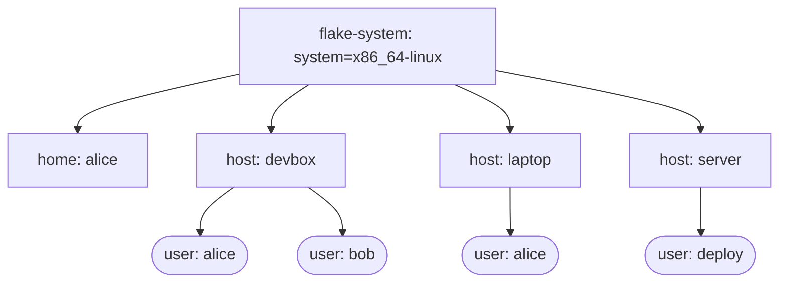
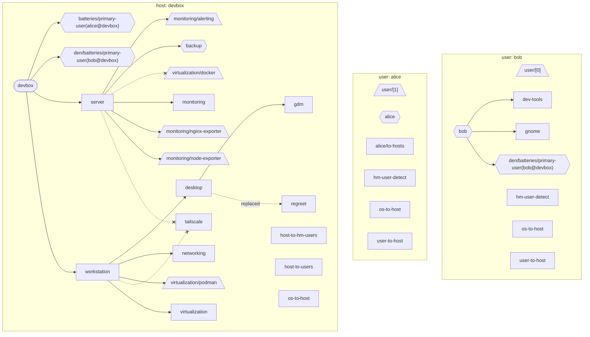
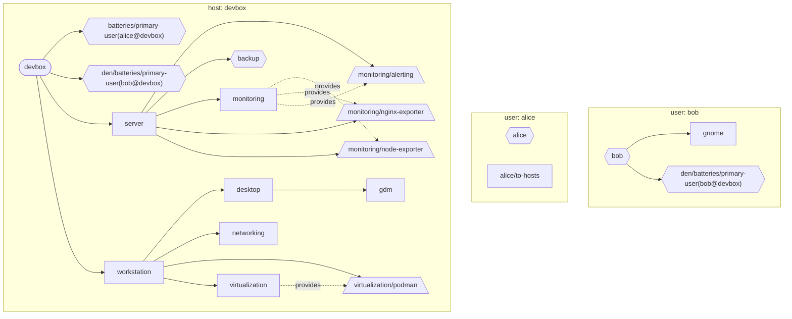
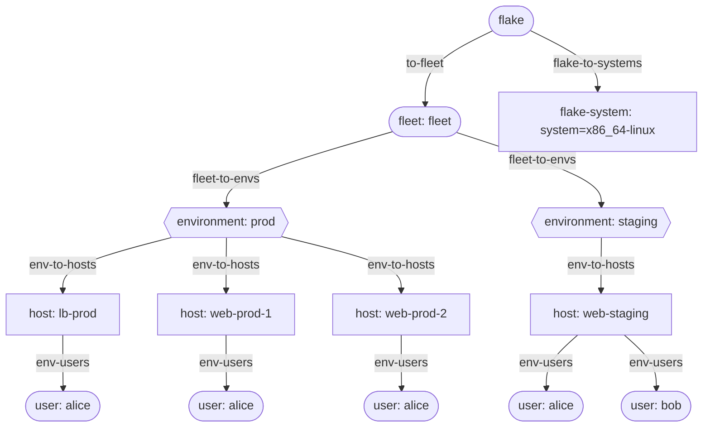
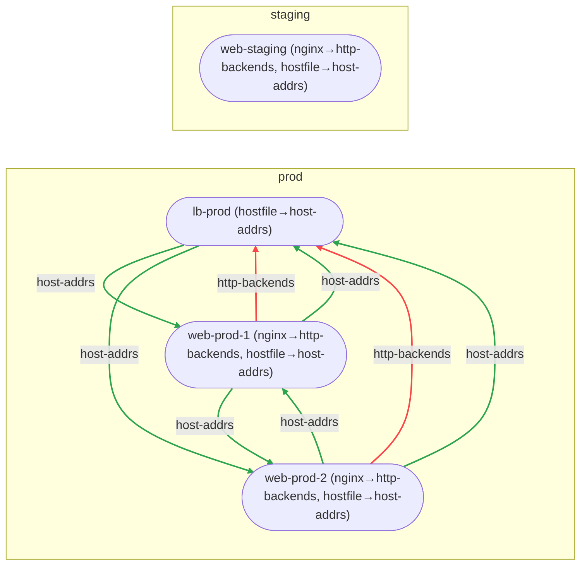
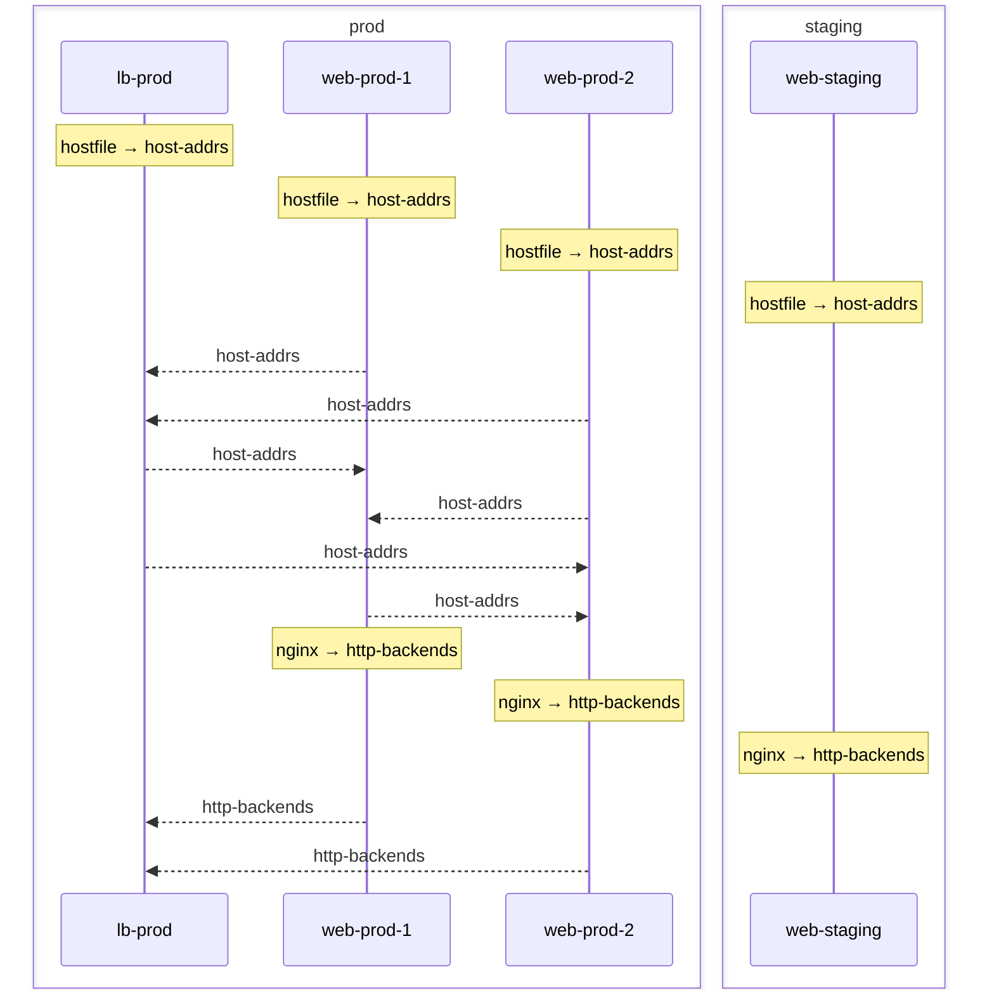

import { Aside } from '@astrojs/starlight/components';

<Aside title="Source" icon="github">
The flake wiring is adapted from the diagrams module of a production
multi-host flake. Every diagram on this page was generated from the
[`diagram-demo`](https://github.com/denful/den/tree/main/templates/diagram-demo)
and [`fleet-demo`](https://github.com/denful/den/tree/main/templates/fleet-demo)
templates with [den-diagram](https://github.com/denful/den-diagram), with
only the colour directives filtered out so the site theme applies. None of
them was drawn by hand.
</Aside>

## Why diagram a den config

A den configuration is spread over many small files: aspects include other
aspects, policies fire when their context arguments are present, scopes nest
per host and user, and pipes move data between hosts. The resulting
`nixosConfiguration` is correct or it is not, but it does not tell you how it
was assembled. A diagram answers the questions you would otherwise answer
with `nix repl` and `builtins.trace`:

- **Which aspects reach this host?** And which were excluded or replaced
  on the way.
- **Where did this class module come from?** Which chain of includes put a
  `nixos` module into a host.
- **How do scopes nest?** Which users exist on which hosts, and under which
  environment.
- **Which policies fired?** At which scope, and what they resolved.
- **Who feeds whom?** Which hosts emit into a pipe and which collect from it.

The diagrams are generated from the same pipeline run that builds the
configuration, so they cannot drift from it.

## The two-step pattern in a flake

Diagrams take two steps. [`den.lib.capture`](/reference/diag/#trace-capture)
runs the fx pipeline with tracing handlers and records what happened.
den-diagram turns that record into a graph IR, filters it, and renders it.
den does not depend on den-diagram; a flake that wants diagrams adds it as
an input:

```nix
# flake.nix
inputs.den-diagram.url = "github:denful/den-diagram";
```

The module below is the smallest useful wiring. It captures the whole fleet
once and exposes Mermaid source as plain strings under `flake.diagrams`, so
`nix eval --raw` prints a diagram without building anything:

```nix
# modules/diagrams.nix
{ den, lib, inputs, ... }:
let
  diagram = inputs.den-diagram.lib;
  render = diagram.renderers { };

  # One pipeline run for the whole flake: every scope, host and user.
  fleetCapture = den.lib.capture.captureFleet { };

  hosts = lib.concatMap builtins.attrValues (builtins.attrValues den.hosts);

  hostViews =
    host:
    let
      # Cut one host's subtree out of the fleet capture.
      g = diagram.projectScope {
        inherit fleetCapture;
        kind = "host";
        inherit (host) name;
        direction = "TD";
      };
    in
    {
      "${host.name}-aspects" = render.toMermaid (diagram.graph.aspectsOnly g);
      "${host.name}-nixos" = render.toMermaid (diagram.graph.classSlice "nixos" g);
    };
in
{
  flake.diagrams = {
    scope-topology = render.toScopeTopologyMermaid fleetCapture;
    policy-resolution = render.toPolicyResolutionMapMermaid fleetCapture;
    pipe-flow = render.toPipeFlowMermaid fleetCapture;
    pipe-sequence = render.toPipeSequenceMermaid fleetCapture;
  }
  // lib.mergeAttrsList (map hostViews hosts);
}
```

Three choices in it are worth copying:

- **Capture once.** `captureFleet` walks the whole scope tree from the flake
  root. Per-host graphs come from `projectScope` over that one capture rather
  than from a fresh pipeline run per host.
- **Renderers are pure.** `diagram.renderers { }` needs no `pkgs`, so the
  Mermaid source can live outside `perSystem`. Only turning it into SVG needs
  `pkgs` and mermaid-cli.
- **Filters before renderers.** `aspectsOnly` and `classSlice "nixos"` are
  functions from graph to graph. They compose, and any renderer takes their
  result. The [reference](/reference/diag/#filters) lists them all.

### Going further: SVGs, galleries and a write script

The production flake this is modelled on keeps the same capture and adds the
export side of den-diagram. A `renderContext` bundles a theme, Mermaid
settings and SVG builders; `export.entityEntries` expands a list of view
definitions into one Markdown and one SVG derivation per view; and
`export.mkWriteScript` copies the lot into the repository:

```nix
perSystem = { pkgs, ... }:
  let
    rc = diagram.renderContext {
      inherit pkgs;
      theme = diagram.themeFromBase16 { inherit pkgs; scheme = "catppuccin-mocha"; };
      mermaidConfig.layout = "elk";
    };

    hostEntries = lib.concatMap (host:
      let entity = hostGraphs.${host.name}; in   # projectScope, as above
      diagram.export.entityEntries { inherit pkgs rc; } {
        inherit entity;
        inherit (host) name;
        dir = "hosts/${host.name}";
        viewDefs = rc.views.host ++ rc.views.classViews [ "nixos" "homeManager" ];
      }) hosts;
  in
  {
    # legacyPackages, not packages: the eval cache walks packages.*,
    # and that would force the fleet capture on every evaluation.
    legacyPackages.diagrams = diagram.export.entriesToPackages hostEntries // {
      write-diagrams = diagram.export.mkWriteScript pkgs {
        entries = hostEntries;
        destExpr = ''"$(${pkgs.git}/bin/git rev-parse --show-toplevel)"'';
      };
    };
  };
```

It also writes a `TOPOLOGY.md` that embeds the fleet views inline, so GitHub
renders them. For that it drops the `%%{init: …}%%` line den-diagram puts at
the top of each diagram, so the Mermaid source falls back to the viewer's own
theme. The two templates do the same in full: `diagram-demo` renders every
host, user and home view, and `fleet-demo` assembles its README from the
fleet views.

## A gallery

The diagrams below are the output of the module above, run against the two
templates. `diagram-demo` has three hosts (`laptop`, `server`, `devbox`) under
den's default scope tree. `fleet-demo` builds its own tree, flake → fleet →
environment → host → user, and shares data between hosts through two pipes.

One change was made to each source before embedding it here. den-diagram
colours every node and cluster itself, and this site styles diagrams from its
own palette, so the `%%{init}%%`, `classDef` and `style` lines were filtered
out. The shapes, edges and labels are exactly as generated.

### The scope tree



`toScopeTopologyMermaid` draws the scopes the pipeline created in
`diagram-demo`. Every host and standalone home hangs off the per-system
scope, and each user gets a scope of their own under each host that declares
them. `alice` appears twice because she is a user on two hosts. Those are
two scopes, each with its own context.

<details>
<summary>How this was generated</summary>

```sh
# in a copy of templates/diagram-demo with the module above as modules/diagrams.nix
nix eval --raw .#diagrams.scope-topology \
  | grep -Ev '^\s*(%%\{init|classDef|style )'
```

The same source, with its theme, is in the template's own
`nix build ./templates/diagram-demo#fleet-scope-topology`.

</details>

### Which aspects reach a host



`aspectsOnly` over `devbox`, which includes both the `workstation` and the
`server` role. The dashed `-x` edges are exclusions: `devbox` removes
`tailscale` and `virtualization/docker` with `constraints.exclude`, and the
diagram still shows who tried to include them. The `replaced` edge is
`constraints.substitute` swapping the `regreet` greeter for `gdm`. Hexagons
are parametric aspects, trapezoids are sub-aspects reached through
`provides`, and the loose nodes (`host-to-users`, `os-to-host`, …) are the
policies that fired in each scope.

<details>
<summary>How this was generated</summary>

```sh
# in a copy of templates/diagram-demo with the module above as modules/diagrams.nix
nix eval --raw .#diagrams.devbox-aspects \
  | grep -Ev '^\s*(%%\{init|classDef|style )'
```

The template's own `nix build ./templates/diagram-demo#devbox-aspects` renders
the same graph left to right, in its theme and with the ELK layout.

</details>

### One class at a time



`classSlice "nixos"` keeps the aspects whose `nixos` content reached
`devbox`, plus the chain of includes above each one. That answers "where did
this NixOS module come from": follow the arrows back from a node to the host.
The excluded and replaced aspects are gone, as are the policies, and the
dotted `provides` edges show which parent aspect a sub-aspect was taken from.

<details>
<summary>How this was generated</summary>

```sh
# in a copy of templates/diagram-demo with the module above as modules/diagrams.nix
nix eval --raw .#diagrams.devbox-nixos \
  | grep -Ev '^\s*(%%\{init|classDef|style )'
```

The template's own `nix build ./templates/diagram-demo#devbox-class-nixos`
renders the same slice left to right.

</details>

### Which policies fired, and where



`toPolicyResolutionMapMermaid` is the scope tree of `fleet-demo` with the
policies on the edges: each edge names the policy that created the scope it
points to. At the root, `to-fleet` creates the fleet and `flake-to-systems`
the per-system scope. `fleet-to-envs` fans the fleet out into environments
and `env-to-hosts` places each host in one. Users come from a registry, not
from `den.hosts`: `env-users` grants `alice` (group `admin`) every host, and
`bob` (group `deploy`) only the staging one. Nothing hangs from
`flake-system`: den still creates the per-system scope, but `fleet-demo`
places its hosts under `fleet` instead.

<details>
<summary>How this was generated</summary>

```sh
# in a copy of templates/fleet-demo with the module above as modules/diagrams.nix
nix eval --raw .#diagrams.policy-resolution \
  | grep -Ev '^\s*(%%\{init|classDef|style )'
```

Byte-identical after the same filter to the template's own
`nix build ./templates/fleet-demo#fleet-policy-resolution`.

</details>

### Who feeds whom



`toPipeFlowMermaid` draws the two pipes of `fleet-demo`, grouped by the
environment that bounds them. `http-backends` runs one way, from the `nginx`
hosts into the load balancer. `host-addrs` runs between every pair of prod
hosts, because each emits its address and each collects its peers'. Each node
label lists which aspect emitted into which pipe. `web-staging` emits into
both pipes but has no edges, because it is the only host in `staging`: the
pipes stop at the environment boundary.

<details>
<summary>How this was generated</summary>

```sh
# in a copy of templates/fleet-demo with the module above as modules/diagrams.nix
nix eval --raw .#diagrams.pipe-flow \
  | grep -Ev '^\s*(%%\{init|classDef|style )'
```

Byte-identical after the same filter to the template's own
`nix build ./templates/fleet-demo#fleet-pipe-flow`.

</details>

### The same pipes as a sequence



`toPipeSequenceMermaid` shows the same data as emit and collect steps, one
lifeline per host, boxed by environment. It reads well when a pipe has many
producers and one consumer. The order of the arrows is not an evaluation
order: `pipe.collect` gathers peer emissions as an unordered list.

<details>
<summary>How this was generated</summary>

```sh
# in a copy of templates/fleet-demo with the module above as modules/diagrams.nix
nix eval --raw .#diagrams.pipe-sequence \
  | grep -Ev '^\s*(%%\{init|classDef|style )'
```

Byte-identical after the same filter to the template's own
`nix build ./templates/fleet-demo#fleet-pipe-sequence`.

</details>

## Producing them yourself

Both templates already expose their views as packages, one Markdown file per
view (and an SVG next to it, suffixed `-mmd-svg`). From a checkout of den:

```sh
# list what a template exposes
nix eval --override-input den . ./templates/diagram-demo#packages.x86_64-linux \
  --apply builtins.attrNames

# one view, as Markdown with a mermaid block
nix build --override-input den . ./templates/diagram-demo#devbox-aspects && cat result

# the rendered SVG of the same view
nix build --override-input den . ./templates/diagram-demo#devbox-aspects-mmd-svg

# every view, written into the template directory
nix run ./templates/diagram-demo#write-diagrams
nix run ./templates/fleet-demo#write-diagrams
```

In your own flake, add the `den-diagram` input and the module from
[the two-step pattern](#the-two-step-pattern-in-a-flake), then:

```sh
nix eval .#diagrams --apply builtins.attrNames         # the views you have
nix eval --raw .#diagrams.<host>-aspects > host.mmd
mmdc -i host.mmd -o host.svg                           # mermaid-cli, if you want an image
```

For the fleet views, `fleetCapture` is all you need, and it already holds
every host. For a single host with nothing else in the flake, the
[reference](/reference/diag/#two-step-pattern) shows the lower-level
`captureWithPathsWith` + `diagram.context` form.

## See also

- [Diagrams](/explanation/diagrams/): the capture, graph, filter and render stages
- [den.lib.capture & den-diagram](/reference/diag/): every filter, renderer and export helper
- [Fleet Demo](/tutorials/fleet-demo/): the template behind the fleet diagrams
- [Cross-Scope Pipes](/guides/quirks-cross-scope/): what the pipe diagrams are drawing
- [Policies reference](/reference/policies/): `resolve.to` and the policies in the resolution map
- [den-diagram](https://github.com/denful/den-diagram): the rendering library
