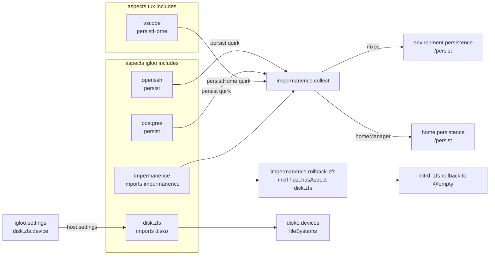

import { Aside } from '@astrojs/starlight/components';

<Aside title="Source" icon="github">
Adapted from a production NixOS fleet flake where every server wipes its root
on boot. Hostnames and disk ids here are placeholders. The den-side flow on
this page (per-host device, `persist` and `persistHome` collection, rollback
gating, a host without impermanence) was checked with a `denTest` probe
against stub `disko` and `impermanence` modules.
</Aside>

## The problem

Two third-party NixOS modules show up in most "how do I use X with den"
questions:

<Aside type="note" title="disko">
[**disko**](https://github.com/nix-community/disko) describes disks in Nix:
partitions, encryption, filesystems, ZFS pools and btrfs subvolumes. You set
`disko.devices`; disko can partition and format a disk from it (during
install), and it generates the matching `fileSystems` entries so the installed
system mounts what it created.
</Aside>

<Aside type="note" title="impermanence">
An **impermanent** system throws its root filesystem away at every boot and
starts from an empty one. Whatever should survive has to be listed and kept on
a separate volume, usually `/persist`. The
[impermanence](https://github.com/nix-community/impermanence) module takes
that list as `environment.persistence."/persist"` (system paths) and
`home.persistence."/persist"` (home paths), and bind-mounts each path from
`/persist` into place at boot. The upside is that nothing accumulates: state
you didn't declare is gone after a reboot.
</Aside>

Put into a fleet, the pieces don't fall into one place:

- the **module** comes from a flake input and has to be imported somewhere;
- the **layout** differs by filesystem (ZFS on one host, btrfs on another);
- the **device** differs by machine, even when the layout is the same;
- the **list of paths to keep** is the sum of what every enabled service
  needs, and that changes whenever a host gains or loses a service;
- the **rollback** that empties the root depends on the filesystem.

The answer below keeps each fact in one place:

1. The aspect that uses a third-party module imports it.
2. One disk-layout aspect per filesystem choice.
3. The device is a per-host [setting](/guides/aspect-settings/) of that aspect.
4. Each service aspect declares what it persists through a
   [quirk](/guides/quirks/), and one collector turns the pool into
   `environment.persistence`.
5. The rollback that runs on boot is picked by which layout the host includes.

## The pieces

### 1. Import a module where it is used

A flake input's NixOS module is ordinary module content, so it goes into the
`imports` of the aspect that sets its options:

```nix
{ inputs, ... }:
{
  den.aspects.disk.zfs.nixos = {
    imports = [ inputs.disko.nixosModules.disko ];
    disko.devices = { /* … */ };
  };
}
```

The host never mentions disko. It includes `disk.zfs`, and the import comes
with it. A host that includes no disk aspect never evaluates
`inputs.disko` at all, which also covers the
["inputs per aspect"](https://github.com/denful/den/discussions/336) question
as far as evaluation goes. The input itself is still declared once for the
whole flake (in `flake.nix`, or next to the aspect with `flake-file.inputs`
if you use [flake-file](/tutorials/default/)).

`inputs` here is the flake-parts module argument. Outside flake-parts,
[`den.batteries.flake-scope`](/reference/batteries/#denbatteriesflake-scope)
makes `inputs` available to parametric aspects.

<Aside type="tip" title="hardware-configuration.nix and facter">
The same rule answers "where does my hardware config go": import it from the
host's own aspect, `den.aspects.igloo.nixos.imports = [ ./hardware-configuration.nix ];`.
When disko owns the disks, generate that file with
`nixos-generate-config --no-filesystems` so its `fileSystems` don't fight
disko's. The source config uses
[nixos-facter-modules](https://github.com/nix-community/nixos-facter-modules)
instead: one shared aspect imports the module and points it at a per-host
report file, `facter.reportPath = host.facts;` (`facts` is a user-defined
host option defaulting to `hosts/<name>/facter.json`).
</Aside>

### 2. One layout aspect per filesystem

The source config has one aspect per layout: `disk.zfs-disk-single` (an
encrypted ZFS pool) and `disk.btrfs-disko` (LUKS plus btrfs subvolumes). This
page shortens them to `disk.zfs` and `disk.btrfs`. Both produce the same mount
points, `/`, `/nix`, `/home`, `/persist` (and `/cache`, see
[below](#a-second-lifetime-cache)), so nothing above the disk layer has to
know which one a host uses.

<Aside type="note" title="Rolling back with ZFS and btrfs snapshots">
ZFS and btrfs both take **snapshots**: a read-only, instant copy of a
filesystem (a ZFS *dataset* or a btrfs *subvolume*) at one moment. For an
impermanent root, you take a snapshot of the root while it's still empty,
right after creating it (ZFS: `zroot/local/root@empty`; btrfs: a
`root-blank` subvolume). At every boot, before the root is mounted, a service
in the initrd (the small early-boot system that mounts the real root) puts
the root back to that empty state: `zfs rollback` on ZFS, delete and
re-snapshot on btrfs. `/persist` is a separate dataset or subvolume, so the
rollback doesn't touch it.
</Aside>

<Aside type="note" title="tmpfs root, the no-snapshot option">
A third way to get an empty root is to make `/` a **tmpfs**, a filesystem that
lives in RAM (`fileSystems."/" = { device = "none"; fsType = "tmpfs"; options = [ "size=2G" "mode=755" ]; };`).
It is empty at every boot by construction, so there is no rollback step, but
everything written to `/` uses memory until the next reboot. The source
config uses ZFS rollback for the root and puts only `/tmp` on tmpfs
(`boot.tmp.useTmpfs = true`).
</Aside>

The ZFS layout, trimmed to the parts that matter here:

```nix
{ den, lib, inputs, ... }:
{
  den.aspects.disk.zfs = {
    settings.device = lib.mkOption {
      type = lib.types.str;
      description = "Disk for the zroot pool, e.g. /dev/disk/by-id/nvme-...";
    };

    nixos = { host, ... }: {
      imports = [ inputs.disko.nixosModules.disko ];

      disko.devices = {
        disk.main = {
          type = "disk";
          device = host.settings.disk.zfs.device;
          content = {
            type = "gpt";
            partitions = {
              ESP = {
                type = "EF00";
                size = "500M";
                content = { type = "filesystem"; format = "vfat"; mountpoint = "/boot"; };
              };
              zfs = {
                size = "100%";
                content = { type = "zfs"; pool = "zroot"; };
              };
            };
          };
        };
        zpool.zroot = {
          type = "zpool";
          rootFsOptions = {
            mountpoint = "none";
            compression = "zstd";
            # create-time only; see Pitfalls
            normalization = "none";
            utf8only = "off";
          };
          datasets = {
            "local/root" = {
              type = "zfs_fs";
              mountpoint = "/";
              options.mountpoint = "legacy";
              # the empty snapshot that every boot rolls back to
              postCreateHook = "zfs snapshot zroot/local/root@empty";
            };
            "local/nix"     = { type = "zfs_fs"; mountpoint = "/nix";     options.mountpoint = "legacy"; };
            "local/home"    = { type = "zfs_fs"; mountpoint = "/home";    options.mountpoint = "legacy"; };
            "local/persist" = { type = "zfs_fs"; mountpoint = "/persist"; options.mountpoint = "legacy"; };
          };
        };
      };

      # impermanence bind-mounts from /persist during early boot
      fileSystems."/persist".neededForBoot = true;
    };
  };
}
```

The btrfs layout has the same shape. Its root is a subvolume plus a read-only
`root-blank` snapshot taken in `postCreateHook`:

```nix
den.aspects.disk.btrfs = {
  settings.device = lib.mkOption { type = lib.types.str; };

  nixos = { host, ... }: {
    imports = [ inputs.disko.nixosModules.disko ];
    disko.devices.disk.main = {
      type = "disk";
      device = host.settings.disk.btrfs.device;
      content.type = "gpt";
      content.partitions.root = {
        size = "100%";
        content = {
          type = "btrfs";
          extraArgs = [ "-L" "nixos" "-f" ];
          postCreateHook = ''
            mount -t btrfs /dev/disk/by-label/nixos /mnt
            btrfs subvolume snapshot -r /mnt/root /mnt/root-blank
            umount /mnt
          '';
          subvolumes = {
            "/root"    = { mountpoint = "/"; };
            "/nix"     = { mountpoint = "/nix"; };
            "/persist" = { mountpoint = "/persist"; };
          };
        };
      };
    };
    fileSystems."/persist".neededForBoot = true;
  };
};
```

The source config's btrfs layout also wraps the volume in LUKS and adds an
ESP and optional swap; those are plain disko and are left out here.

### 3. The device is a setting

`settings.device` above is an [aspect setting](/guides/aspect-settings/): the
aspect declares a typed option and reads it as `host.settings.disk.zfs.device`,
and each host sets its own value. The settings type generator and the
`den.reservedKeys = [ "settings" ]` line it needs are user code; the
[Aspect Settings quick start](/guides/aspect-settings/#quick-start) has them
in full.

Leaving out `default` makes the device required. A host that includes
`disk.zfs` without setting it fails evaluation with the full option path,
which is better than partitioning the wrong disk.

<Aside type="tip" title="Detecting the disk">
The source config's btrfs layout gives `device_id` a default of `""` and,
when it's empty, picks the disk from the facter report: the single non-USB
disk, or an `abort` asking for `device_id` if there are several. That logic
is user code inside the aspect's `nixos` module:

```nix
disk-device =
  if cfg.device_id != "" then cfg.device_id
  else
    let
      native = builtins.filter (d: d.driver != "usb-storage") config.facter.report.hardware.disk;
    in
    if builtins.length native == 1
    then lib.findFirst (lib.hasPrefix "/dev/disk/by-id/") null (builtins.head native).unix_device_names
    else abort "Multiple disks found. Set settings.disk.btrfs-disko.device_id.";
```
</Aside>

### 4. Each aspect declares what it persists

[Quirk Recipes](/guides/quirk-recipes/#every-aspect-declares-what-it-persists)
has the short version of this pattern. Four quirks, one per volume and level:

```nix
den.quirks.persist.description     = "System paths kept on /persist";
den.quirks.cache.description       = "System paths kept on /cache";
den.quirks.persistHome.description = "Home paths kept on /persist";
den.quirks.cacheHome.description   = "Home paths kept on /cache";
```

A service aspect lists its paths next to the config that creates them:

```nix
den.aspects.postgres = {
  nixos.services.postgresql.enable = true;
  persist.directories = [ "/var/lib/postgresql" ];
};

den.aspects.openssh = {
  nixos.services.openssh.enable = true;
  persist.directories = [ "/etc/ssh" ];
};

den.aspects.vscode = {
  homeManager.programs.vscode.enable = true;
  persistHome.directories = [ ".config/Code" ];
};
```

The service aspect doesn't know or care whether the host is impermanent. It
works unchanged on a host that keeps its root (see
[A host without impermanence](#a-host-without-impermanence)).

The `impermanence` aspect imports the module, sets the fleet-wide defaults
and includes the collector and the rollbacks:

```nix
{ den, lib, inputs, ... }:
{
  den.aspects.impermanence = {
    includes = [
      den.aspects.impermanence.collect
      den.aspects.impermanence.rollback-zfs
      den.aspects.impermanence.rollback-btrfs
    ];

    settings.wipeRootOnBoot = lib.mkOption {
      type = lib.types.bool;
      default = true;
      description = "Roll the root filesystem back to its empty snapshot on boot";
    };

    nixos = {
      imports = [ inputs.impermanence.nixosModules.impermanence ];
      environment.persistence."/persist" = {
        hideMounts = true;
        files = [
          "/etc/machine-id"
          "/etc/adjtime"
          "/var/lib/systemd/credential.secret"
        ];
      };
    };
  };
}
```

The collector reads each pool as a module argument. A quirk's value is a
list with one entry per aspect that set it, so the collector flattens and
de-duplicates:

```nix
den.aspects.impermanence.collect = {
  nixos = { persist, lib, ... }: {
    environment.persistence."/persist" = {
      directories = lib.unique (lib.concatMap (e: e.directories or [ ]) persist);
      files = lib.unique (lib.concatMap (e: e.files or [ ]) persist);
    };
  };
  homeManager = { persistHome, lib, ... }: {
    home.persistence."/persist" = {
      directories = lib.unique (lib.concatMap (e: e.directories or [ ]) persistHome);
      files = lib.unique (lib.concatMap (e: e.files or [ ]) persistHome);
    };
  };
};
```

Definitions merge through the module system, so the collector's
`directories` join the defaults set in `impermanence.nixos`.

Nothing needs to import impermanence's Home Manager module separately:
when home-manager is present, impermanence's NixOS module adds its Home
Manager module to `home-manager.sharedModules` itself, so `home.persistence`
exists in every user's home once the NixOS module is imported on the host.

### 5. Rollback on boot

The rollback belongs to the pairing of "impermanent" and "this filesystem".
The source config keeps both variants under `impermanence` and gates each one
on the layout the host includes, with
[`host.hasAspect`](/explanation/structural-introspection/#reading-structure-entityhasaspect):

```nix
den.aspects.impermanence.rollback-zfs.nixos = { host, config, lib, ... }: {
  config = lib.mkIf (host.hasAspect den.aspects.disk.zfs && host.settings.impermanence.wipeRootOnBoot) {
    boot.initrd.systemd.services.rollback-root = {
      description = "Roll the root dataset back to @empty";
      wantedBy = [ "initrd.target" ];
      after = [ "zfs-import-zroot.service" ];
      before = [ "sysroot.mount" ];
      path = [ config.boot.zfs.package ];
      unitConfig.DefaultDependencies = "no";
      serviceConfig.Type = "oneshot";
      script = "zfs rollback -r zroot/local/root@empty";
    };
  };
};
```

`rollback-btrfs` is the same, gated on `disk.btrfs`, with a script that
mounts the top-level volume, deletes `root` (and any subvolumes nested under
it first), and snapshots `root-blank` back to `root`.

Gating happens inside `config = lib.mkIf …`, not around the whole module, so
the module's structure stays the same whatever the condition is.

## The fleet

Two impermanent hosts with different layouts, and one ordinary host:

```nix
{ den, ... }:
{
  den.hosts.x86_64-linux.igloo = {
    users.tux = { };
    settings.disk.zfs.device = "/dev/disk/by-id/nvme-EXAMPLE_0001";
  };

  den.hosts.x86_64-linux.iceberg = {
    settings.disk.btrfs.device = "/dev/disk/by-id/ata-EXAMPLE_0002";
    settings.impermanence.wipeRootOnBoot = false;
  };

  den.hosts.x86_64-linux.floe = { };

  den.aspects.igloo.includes = [
    den.aspects.disk.zfs
    den.aspects.impermanence
    den.aspects.openssh
    den.aspects.postgres
  ];
  den.aspects.iceberg.includes = [
    den.aspects.disk.btrfs
    den.aspects.impermanence
    den.aspects.openssh
  ];
  den.aspects.floe.includes = [ den.aspects.openssh ];

  den.aspects.tux.includes = [ den.batteries.host-aspects den.aspects.vscode ];
}
```

What each host gets:

| | igloo | iceberg | floe |
|---|---|---|---|
| `disko.devices.disk.main.device` | `…nvme-EXAMPLE_0001` | `…ata-EXAMPLE_0002` | no disko |
| `environment.persistence."/persist".directories` | `/etc/ssh`, `/var/lib/postgresql` | `/etc/ssh` | no option |
| rollback service in initrd | yes (ZFS) | no (`wipeRootOnBoot = false`) | no |
| tux's `home.persistence."/persist".directories` | `.config/Code` | | |

Each row was checked by the probe, with stub modules standing in for disko
and impermanence. The probe had only the ZFS rollback, so the iceberg cell
shows that the ZFS rollback stays off on a btrfs host.

Adding `postgres` to `iceberg` adds `/var/lib/postgresql` to its persistence
list, with no edit to the impermanence aspect. Removing `openssh` from a host
removes `/etc/ssh` from its list.

The data flow for `igloo`:



### Getting the home collector to users

The collector's `homeManager` key is on an aspect the **host** includes. A
host aspect's `homeManager` content doesn't reach users on its own. In the
source config, and in the fleet above, each user includes
[`den.batteries.host-aspects`](/reference/batteries/#denbatterieshost-aspects),
which projects the host's `homeManager` content into the user's Home Manager
config. Without it, `home.persistence."/persist"` is never set: the flake
still evaluates, and the home paths just aren't kept.

With `host-aspects`, the `persistHome` pool holds both the user's own
entries (`vscode` included by `tux`) and entries from aspects the host
includes. If `igloo` also included a `firefox` aspect with
`persistHome.directories = [ ".mozilla" ]`, tux's list would be
`.mozilla` and `.config/Code`.

If you don't want `host-aspects`, include the collector on the user instead
(`den.aspects.tux.includes = [ den.aspects.impermanence.collect ];`); then
the pool holds the user's own entries.

### A host without impermanence

`floe` includes `openssh`, which sets `persist`, but not `impermanence`.
The pool still gets collected, nothing reads it, and `floe` evaluates with
`services.openssh.enable = true` and no `environment.persistence` option at
all. That is why service aspects can declare persistence unconditionally.

If a module reads `config.environment.persistence` directly (for example to
find the persistent storage path), it fails on hosts without the option.
Guard it with `host.hasAspect den.aspects.impermanence`, as the source
config's podman aspect does. For platforms without the module at all, the
source config adds a Darwin variant of `impermanence` that only declares
`environment.persistence` and `home.persistence` as no-op options, so shared
Home Manager modules that read them still evaluate.

The [`persys` class](/guides/custom-class-examples/#an-impermanence-class) is
another way to get the same effect: a guarded `forward` that only writes to
`environment.persistence` when the option exists.

## A second lifetime: cache

The source config splits kept state in two: `/persist` for state worth
backing up (keys, databases) and `/cache` for state that is annoying but safe
to lose (`/var/tmp`, `~/.cache`, downloads, container images). Each is a
separate dataset with its own snapshot and backup policy. The `cache` and
`cacheHome` quirks and a second block in the collector are the whole cost:

```nix
den.aspects.impermanence.collect.nixos = { persist, cache, lib, ... }:
  let
    merge = entries: {
      directories = lib.unique (lib.concatMap (e: e.directories or [ ]) entries);
      files = lib.unique (lib.concatMap (e: e.files or [ ]) entries);
    };
  in {
    environment.persistence."/persist" = merge persist;
    environment.persistence."/cache" = merge cache;
  };

den.aspects.attic.cache.directories = [ "/var/lib/atticd" ];
```

The `/cache` entry in `environment.persistence` also needs `hideMounts` and a
`/cache` dataset in each layout. The probe measured only the `persist` and
`persistHome` pools; `cache` works the same way.

## Pitfalls

These come from comments in the source config.

**Persist the files systemd and secrets tooling expect.** Without
`/etc/machine-id` the host gets a new machine ID every boot, and journald
files are keyed by it.
`/var/lib/systemd/credential.secret` is the host key for
`LoadCredentialEncrypted`; if it isn't persisted, any credential encrypted
against it (the source config hit this with libvirt's secret key) can't be
decrypted after the next reboot.

**Secrets decrypt before the bind mounts exist.** agenix runs during
activation, before impermanence has bind-mounted `/etc/ssh`. Point its
identity at the real location, `/persist/etc/ssh/ssh_host_ed25519_key`, and
only on hosts that have impermanence. The source config computes the prefix
from `host.hasAspect den.aspects.impermanence` and `host.class`, because its
Darwin hosts have no `/persist`.

**Don't persist a path that is its own dataset.** On ZFS hosts the source
config gives `/var/lib/containerd` a dedicated dataset. Listing it in
`persist` as well would bind-mount `/persist/var/lib/containerd` over the
dataset's mount point and hide it. Its containerd aspect lists
`/var/lib/cni` and `/var/lib/containers` and leaves `/var/lib/containerd` out
on purpose.

**disko creates datasets at install time only.** disko emits a required
`fileSystems` entry for every dataset in the layout at every switch, but
creates the dataset only when it formats the disk. Adding a dataset to the
layout of a machine that's already installed gives it a mount for something
that doesn't exist, and the boot fails. Create the dataset by hand
(`zfs create …`) before switching, or add a oneshot unit that creates missing
datasets after the pool is imported. The source config had such a unit; its
comments warn that it needs `DefaultDependencies = false` (otherwise it forms
an ordering cycle with the mounts) and `wantedBy` rather than `requiredBy`
(otherwise restarting it unmounts the datasets under running services).

**Some ZFS options can only be set at creation.** `normalization` and
`utf8only` are fixed when the pool's root dataset is created. Anything other
than `normalization = "none"` forces `utf8only = on`, which rejects file names
that aren't valid UTF-8; some package test suites and container images
contain such names. Getting it wrong means rebuilding the dataset.

**Take the empty snapshot at creation.** The rollback target has to exist
before anything writes to the root, so it's made in disko's `postCreateHook`
(`zfs snapshot zroot/local/root@empty`, or the btrfs `root-blank` snapshot).
On btrfs, delete subvolumes nested under `root` (systemd creates some for
containers) before deleting `root` itself.

**`/persist` must be mounted in the initrd.** Set
`fileSystems."/persist".neededForBoot = true` in each layout. The source
config sets it for `/nix`, `/home` and `/cache` too.

**Check directory permissions impermanence creates.** When impermanence
creates `/var/lib` and `/var/lib/private` for bind mounts, they can end up
with an owner or mode that systemd's `DynamicUser` services reject. The source config adds
an activation script, ordered after impermanence's `createPersistentStorageDirs`,
that resets `/var/lib` to `0755` and `/var/lib/private` to `0700`.

**One layout aspect per host.** Both layout aspects set `disk.main` and the
same mount points. Including two on one host produces conflicting
definitions.

## Related questions

- **An SD card image instead of a disk layout.** A Raspberry Pi host doesn't
  need disko: its aspect imports the nixpkgs installer module
  (`nixos.imports = [ "${inputs.nixpkgs}/nixos/modules/installer/sd-card/sd-image-aarch64.nix" ];`),
  and the image is `nixosConfigurations.<host>.config.system.build.sdImage`.
  [Discussion #664](https://github.com/denful/den/discussions/664) shows how
  to expose it as a flake output.
- **A disko config outside a host.** `disko` can also run from
  `flake.diskoConfigurations`, but keeping the layout in the host's
  `nixos` config means the same evaluation that builds the system also
  describes its disks, and `fileSystems` come from one place.

## See also

- [Quirk Recipes](/guides/quirk-recipes/#every-aspect-declares-what-it-persists) — the short version of the persistence pattern
- [Aspect Settings](/guides/aspect-settings/) — the `settings` generator used for the device
- [Custom Class Examples](/guides/custom-class-examples/#an-impermanence-class) — the `persys` class
- [Batteries](/reference/batteries/) — `host-aspects`, `flake-scope`
- [Parametric aspects](/explanation/parametric/) — where `host` is in scope
- [disko](https://github.com/nix-community/disko), [impermanence](https://github.com/nix-community/impermanence)
