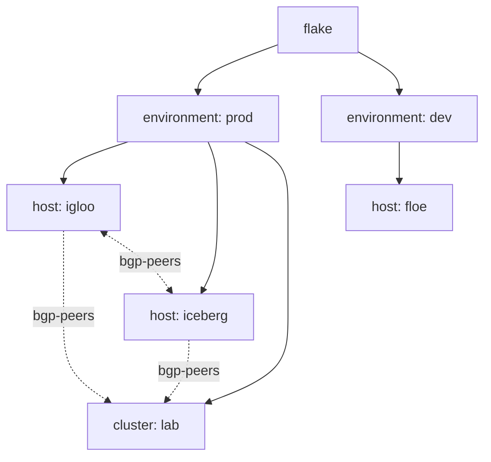

import { Aside } from '@astrojs/starlight/components';

<Aside title="Source" icon="github">
Adapted from a production homelab flake that runs a k3s cluster on NixOS
hosts and renders its Kubernetes manifests with
[nixidy](https://github.com/arnarg/nixidy). Names, addresses and AS numbers
here are placeholders. The pipe behaviour this page relies on is covered by
[`templates/ci/modules/public-api/pipe-scope.nix`](https://github.com/denful/den/blob/main/templates/ci/modules/public-api/pipe-scope.nix).
</Aside>

## The problem

A k3s cluster runs on NixOS hosts. Every node runs FRR for BGP. Cilium's BGP
control plane, inside Kubernetes, peers with the FRR daemon on its own node,
so the cluster needs one `CiliumBGPClusterConfig` per node that carries the
node's hostname, address and AS number.

<Aside type="note" title="Kubernetes and k3s">
**Kubernetes** runs containers across a group of machines (a *cluster*; each
machine is a *node*). You describe what should run as YAML documents called
*manifests*, and Kubernetes keeps the cluster matching them. **k3s** is a
small Kubernetes distribution that NixOS can run with
`services.k3s.enable = true`.
</Aside>

<Aside type="note" title="BGP, AS numbers and FRR">
**BGP** (Border Gateway Protocol) is how routers tell each other which IP
addresses they can reach. Two routers that exchange routes are *peers* (or
*neighbours*). Each router belongs to an **autonomous system**, identified by
an **AS number (ASN)**. Private networks use numbers from 64512 to 65534, as
this page does. **FRR** (FRRouting) is a routing daemon that speaks BGP on a
Linux host; NixOS configures it through `services.frr`.

Here BGP lets the network learn where Kubernetes service addresses live, so
traffic from outside the cluster reaches the right node.
</Aside>

<Aside type="note" title="Cilium">
**Cilium** is a Kubernetes networking plugin: it gives pods their network
and enforces network policy. Its optional **BGP control plane** makes Cilium
act as a BGP speaker, announcing service and pod addresses to a peer. Here
that peer is FRR on the same node, which passes the routes on to the rest of
the network. Cilium's BGP settings are Kubernetes resources, so they are part
of the cluster's manifests, not of the host's NixOS config.
</Aside>

That is two configuration worlds describing the same facts:

- **NixOS**: FRR on each host, with its router ID, its AS number and its
  neighbours.
- **Kubernetes**: Cilium resources, rendered by nixidy into manifests that
  ArgoCD syncs.

<Aside type="note" title="nixidy and ArgoCD">
**nixidy** writes Kubernetes manifests with the Nix module system: you set
typed options such as `applications.<app>.resources…`, and nixidy renders
them to YAML files in a Git repository. **ArgoCD** runs inside the cluster,
watches that repository and applies whatever changes land there (a workflow
called *GitOps*). Den's part ends at producing the nixidy environment; the
rendering and syncing are nixidy's and ArgoCD's.
</Aside>

If a host joins, leaves or gets a new address, both sides have to change
together. The approach below states each fact once, on the host, and has
both sides derive from it:

- a **custom class** (`k8s-manifests`) so aspects can carry Kubernetes config
  next to `nixos`;
- a **cluster entity** that instantiates that class into a nixidy
  environment;
- a **quirk** (`bgp-peers`) that hosts emit and the cluster collects.

## Entity topology

Hosts and clusters both live under an `environment`. The cluster does not
contain its hosts. It sits next to them, and data crosses from host to
cluster through a pipe.



The kinds and their nesting are declared on `den.schema`:

```nix
den.schema.environment.isEntity = true;
den.schema.host.parent = "environment";
den.schema.cluster.isEntity = true;
den.schema.cluster.parent = "environment";
```

Hosts get two user-defined fields: `env` (which environment they belong to)
and `cluster` (which cluster they join, if any). The network identity is
also on the host:

```nix
den.schema.host.imports = [
  ({ lib, ... }: {
    options.env = lib.mkOption { type = lib.types.str; default = "prod"; };
    options.cluster = lib.mkOption { type = lib.types.nullOr lib.types.str; default = null; };
    options.addr = lib.mkOption { type = lib.types.str; };
    options.asn = lib.mkOption { type = lib.types.int; };
  })
];

den.hosts.x86_64-linux.igloo  = { addr = "10.0.0.1"; asn = 64512; cluster = "lab"; };
den.hosts.x86_64-linux.iceberg = { addr = "10.0.0.2"; asn = 64513; cluster = "lab"; };
den.hosts.x86_64-linux.floe   = { addr = "10.0.1.1"; asn = 64514; env = "dev"; };
```

Policies build the tree. The environments and clusters here are plain
attrsets in a `let` binding. The source config keeps them in registry
options of its own (`den.environments`, `den.clusters`), which are
user-defined and not part of den.

```nix
let
  inherit (den.lib.policy) resolve instantiate;
  environments = { prod = { name = "prod"; }; dev = { name = "dev"; }; };
  clusters.lab = { name = "lab"; environment = "prod"; };
in
{
  # flake -> environments
  den.policies.to-envs = _: map (environment: resolve.to "environment" { inherit environment; })
    (builtins.attrValues environments);

  # environment -> its hosts; each host is also instantiated as a NixOS system
  den.policies.env-to-hosts = { environment, ... }:
    lib.concatMap (name:
      let host = den.hosts.x86_64-linux.${name}; in
      lib.optionals (host.env == environment.name) [
        (resolve.to "host" { inherit host; })
        (instantiate host)
      ]) (builtins.attrNames den.hosts.x86_64-linux);

  # environment -> its clusters
  den.policies.env-to-clusters = { environment, ... }:
    lib.concatMap (cluster:
      lib.optional (cluster.environment == environment.name)
        (resolve.to "cluster" { inherit cluster; }))
      (builtins.attrValues clusters);

  den.schema.flake.includes = [ den.policies.to-envs ];
  den.schema.environment.includes = [
    den.policies.env-to-hosts
    den.policies.env-to-clusters
  ];

  # env-to-hosts instantiates hosts itself; turn off den's default per-system walk
  den.schema.flake-system.excludes = [
    den.policies.system-to-os-outputs
    den.policies.system-to-hm-outputs
  ];
}
```

Because hosts are resolved under their environment, `igloo` and `iceberg`
are siblings of each other **and** of `lab`. `floe` is in a different
subtree. This layout decides what `pipe.collect` can see (see
[Lessons](#lessons)).

<Aside type="caution" title="Don't re-parent hosts under the cluster">
It is tempting to add a `cluster -> host` policy so the hosts sit inside the
cluster. `resolve.to "host"` resolves the host entity **again**, so its
schema includes run a second time. The source config got duplicate
instantiate specs that way. Keep one parent per host and move data sideways
with pipes.
</Aside>

## Defining the custom class

A class is an output bucket. Registering one lets any aspect carry a key of
that name:

```nix
den.classes.k8s-manifests.description = "Kubernetes manifests collected for nixidy";
```

Nothing evaluates a class by itself. The cluster entity turns its
`k8s-manifests` modules into a nixidy environment with `policy.instantiate`:

```nix
den.policies.cluster-to-nixidy = { cluster, ... }: [
  (den.lib.policy.instantiate {
    inherit (cluster) name;
    class = "k8s-manifests";
    intoAttr = [ "nixidyEnvs" "x86_64-linux" cluster.name ];
    instantiate = { modules, ... }:
      inputs.nixidy.lib.mkEnv {
        pkgs = inputs.nixpkgs.legacyPackages.x86_64-linux;
        inherit modules;
      };
  })
  # A host entity points at den.aspects.<name> for you. This plain-attrset
  # cluster does not, so include its aspect explicitly.
  (den.lib.policy.include den.aspects.${cluster.name})
];

den.schema.cluster.includes = [ den.policies.cluster-to-nixidy ];
```

`instantiate` receives the `k8s-manifests` modules from the cluster's own
scope subtree, and nothing from sibling hosts. The result lands at
`flake.nixidyEnvs.x86_64-linux.lab`. `mkEnv` is nixidy's API. The source
config also passes `charts` and `extraSpecialArgs` there.

<Aside type="caution" title="Leave `system` off a non-NixOS instantiate spec">
If the spec has a `system` field, den appends
`{ nixpkgs.hostPlatform = system; }` to `modules`. nixidy's module system
has no such option and rejects it. Put the system in `intoAttr` and pick
`pkgs` inside the closure instead.
</Aside>

Shared cluster defaults work like host defaults: put an aspect on
`den.schema.cluster.includes`. Its class module can read the cluster's
context:

```nix
den.aspects.nixidy-defaults.k8s-manifests = { cluster, lib, ... }: {
  nixidy.target = {
    repository = lib.mkDefault "https://git.example.com/infra.git";
    branch = lib.mkDefault "main";
    rootPath = lib.mkDefault "./manifests/${cluster.name}";
  };
};

den.schema.cluster.includes = [ den.aspects.nixidy-defaults ];
```

## The BGP walkthrough

### 1. Declare the quirk

```nix
den.quirks.bgp-peers.description = "BGP identity of each host";
```

### 2. The host half: NixOS config plus a record

One aspect configures FRR on the host and publishes the host's BGP identity.

<Aside type="note" title="Reading the FRR config">
`router bgp <asn>` starts BGP with the host's AS number, and `bgp router-id`
names this router by its address. `neighbor cilium peer-group` with
`bgp listen range <addr>/32` accepts a connection from Cilium on the same
address. The generated `neighbor <addr> remote-as <asn>` lines peer with
every other host. Port 179 is BGP's TCP port.
</Aside>
The `bgp-peers` value is **context-parametric**: it takes `{ host, ... }`,
so den calls it on each host that includes the aspect, and consumers get a
plain record.

```nix
let
  ciliumAsn = 64600; # shared by every node's Cilium instance
in
{
  den.aspects.bgp = {
    bgp-peers = { host, ... }: {
      inherit (host) name addr asn cluster;
    };

    nixos = { host, bgp-peers, lib, ... }:
      let
        others = lib.filter (p: p.name != host.name) bgp-peers;
      in
      {
        services.frr.bgpd.enable = true;
        services.frr.config = ''
          router bgp ${toString host.asn}
           bgp router-id ${host.addr}
           neighbor cilium peer-group
           neighbor cilium remote-as ${toString ciliumAsn}
           bgp listen range ${host.addr}/32 peer-group cilium
          ${lib.concatMapStrings (p: " neighbor ${p.addr} remote-as ${toString p.asn}\n") others}
        '';
        networking.firewall.allowedTCPPorts = [ 179 ];
      };
  };

  den.aspects.igloo.includes = [ den.aspects.bgp ];
  den.aspects.iceberg.includes = [ den.aspects.bgp ];
}
```

The `nixos` module reads `bgp-peers` too. On a host, the pool holds the
host's own record plus whatever a host-scope policy collects:

```nix
den.policies.host-bgp-peers = { host, ... }:
  let inherit (den.lib.policy) pipe; in
  [ (pipe.from "bgp-peers" [ (pipe.collect ({ host, ... }: true)) ]) ];

den.schema.host.includes = [ den.policies.host-bgp-peers ];
```

`igloo` now peers with `iceberg` and not with `floe`, because `floe` is not
a sibling. The pool includes the host's own record, which is why the module
filters out `host.name`.

### 3. The pipe into the cluster

The cluster collects the same records. Cluster and hosts share a parent
environment, so `pipe.collect` from the cluster scope sees exactly the
environment's hosts. A `pipe.filter` then narrows the pool to members of
this cluster:

```nix
den.policies.cluster-bgp-peers = { cluster, ... }:
  let inherit (den.lib.policy) pipe; in
  [ (pipe.from "bgp-peers" [
      (pipe.collect ({ host, ... }: true))
      (pipe.filter (p: p.cluster == cluster.name))
    ]) ];

den.schema.cluster.includes = [ den.policies.cluster-bgp-peers ];
```

The filter runs in the cluster's scope only. The hosts' own view of
`bgp-peers` does not change.

### 4. The cluster half: Kubernetes config from the records

The cluster aspect's `k8s-manifests` module reads the same quirk by name
and generates one Cilium resource per node. It belongs in the same file, and
the same `let`, as `den.aspects.bgp`, so both halves share `ciliumAsn`:

```nix
# inside the `let ciliumAsn = 64600; in { … }` block from step 2
den.aspects.cilium-bgp.k8s-manifests = { bgp-peers, lib, ... }: {
  applications.cilium.resources.ciliumBGPClusterConfigs = lib.listToAttrs (map (node: {
    name = "cilium-bgp-${node.name}";
    value.spec = {
      nodeSelector.matchLabels."kubernetes.io/hostname" = node.name;
      bgpInstances = [ {
        name = "local-frr";
        localASN = ciliumAsn;
        peers = [ {
          name = "local-frr";
          peerASN = node.asn;
          peerAddress = node.addr;
          peerConfigRef.name = "cilium-bgp";
        } ];
      } ];
    };
  }) bgp-peers);
};

den.aspects.lab.includes = [ den.aspects.cilium-bgp ];
```

<Aside type="note" title="CRDs">
Kubernetes can be extended with new resource kinds. A **Custom Resource
Definition (CRD)** declares one. Cilium ships CRDs such as
`CiliumBGPClusterConfig`, so its settings are ordinary Kubernetes resources.
nixidy can generate typed Nix options from a CRD, which is how
`ciliumBGPClusterConfigs` below gets type checking.
</Aside>

<Aside>
`ciliumBGPClusterConfigs` is not built into nixidy. It is a resource type
generated from Cilium's CRDs and registered through
`nixidy.applicationImports`. The source config emits CRD specs through a
second quirk (`crds`) and builds the types inside a cluster-wide
`k8s-manifests` module, where `pkgs` is available.
</Aside>

### The result

Adding a fourth host with `cluster = "lab"` and `includes = [ den.aspects.bgp ]`
changes three things at once, with no edit to any aspect:

- the new host's FRR config;
- every other `prod` host's FRR neighbour list;
- the `lab` cluster's Cilium resources.

A host in `dev` with `cluster = "lab"` would change none of them, because the
cluster's `collect` stops at its environment.

## One concern, two entities

The BGP concern lives in two aspects, `bgp` and `cilium-bgp`, and not one
aspect with `nixos` and `k8s-manifests` side by side. A class key lands in
the scope where its aspect is included. If `k8s-manifests` sits on an aspect
that only hosts include, it is emitted at host scope and the cluster's
instantiate never sees it. The flake still evaluates. The cluster's
manifests just don't have it.

The shape that works:

| Aspect | Included by | Keys |
|--------|-------------|------|
| `bgp` | hosts | `nixos`, `bgp-peers` (emit) |
| `cilium-bgp` | the cluster | `k8s-manifests` (reads `bgp-peers`) |

The quirk is the edge between them. Keep both aspects in one file so the
concern still reads as one unit.

## Lessons

**Name the entity kind in every collect predicate.** A scope is harvested
only when its own kind is a required argument of the predicate.
`({ host, ... }: true)` from a cluster policy reaches host scopes. `(_: true)`
names no kind and matches nothing, and the result is an empty list, not an
error.

**`collect` follows the tree, `collectAll` doesn't.** From the cluster,
`pipe.collect` sees the hosts under the same environment.
`pipe.collectAll ({ host, ... }: true)` sees every host in the fleet, so
`floe` in `dev` shows up too. The source config uses `collectAll` and filters
on the record's environment inside the consumer. Use that when cluster
membership does not follow the tree, for example a cluster that spans
environments. When it does, `collect` gives you the boundary for free.

**Filter in the policy, not in every consumer.** A `pipe.filter` after
`collect` narrows the pool for every `k8s-manifests` module in that cluster.
Several consumers read `bgp-peers`, so filtering once in the policy saves
repeating it in each of them.

**Records for another entity should be context-parametric.** `bgp-peers`
reads only `host`, so it resolves to a plain record on the host before it
moves. A value that takes `{ config, ... }` is a
[config-dependent thunk](/guides/quirks/#config-dependent-thunks) and
resolves against the producing host's NixOS config. That ties the cluster's
manifests to each member host's NixOS evaluation. Anything the cluster needs
is better kept as host schema data (`host.addr`, `host.asn`, per-aspect
settings) than read back out of the host's NixOS config. That is also how
the source config does it.

**Custom entities need their aspect included.** Hosts pick up
`den.aspects.<name>` through their entity. A cluster declared as a plain
attrset does not, so the cluster policy includes `den.aspects.${cluster.name}`
itself.

## See also

- [Cross-Scope Pipes](/guides/quirks-cross-scope/) — `collect`, `collectAll`, predicates
- [Quirks & Pipes guide](/guides/quirks/) — scoping, context-parametric values, thunks
- [Custom Classes](/guides/custom-classes/) — registering classes
- [Policies reference](/reference/policies/) — `resolve.to`, `include`, `instantiate`
- [Terranix Demo](/tutorials/terranix-demo/) — the same instantiate pattern for Terraform
- [nixidy](https://github.com/arnarg/nixidy) — Kubernetes manifests from the module system
